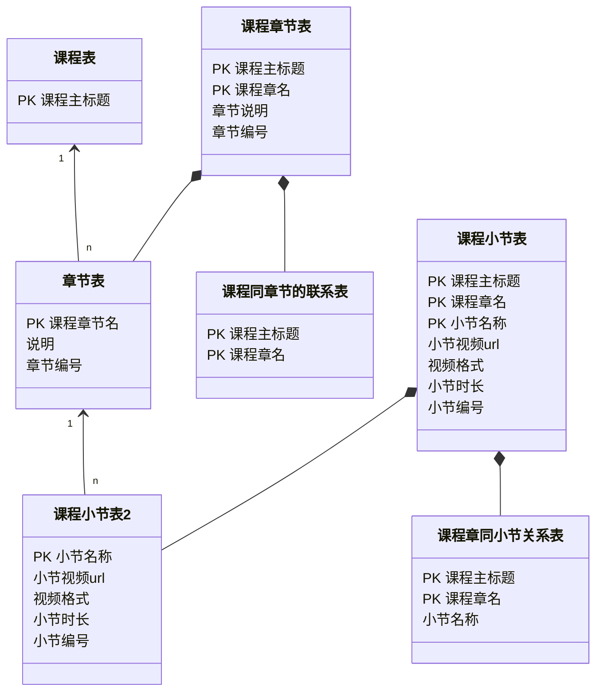
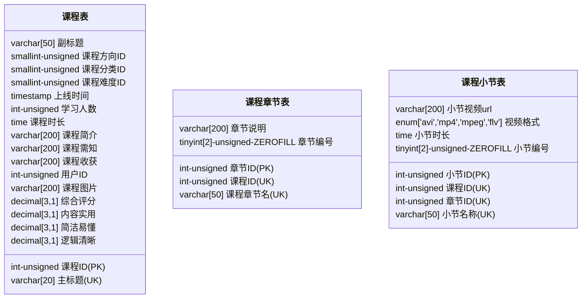
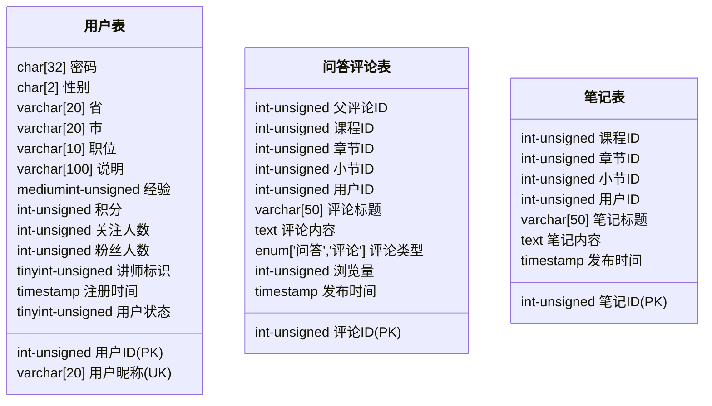
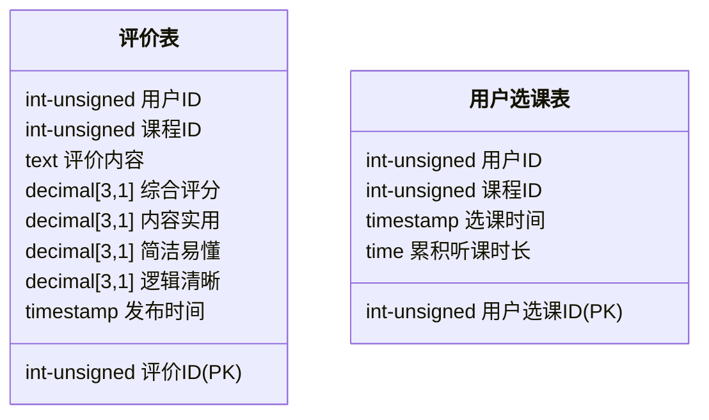
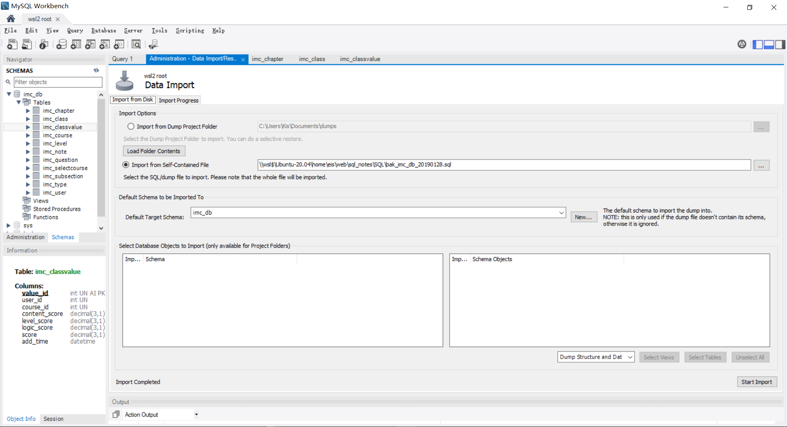
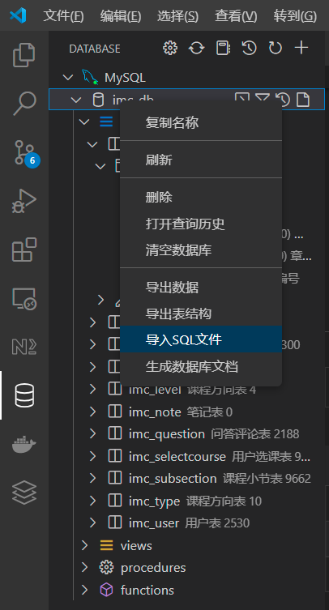

# 基础入门 全角度解读企业主流数据库 MySQL8.0

## 第 1 章 开篇引导

开篇将告诉同学们这几件事：

1.  为什么设计本课程？课程将帮助你 Get√ 到什么。
2.  课程适合人群？针对特定的人将收获什么。
3.  课程提供什么样的服务？如：查漏补缺问题库、答疑服务、QQ 群人脉资源...
4.  课程内容有哪些？通过思维导图，直观清晰呈现课程所涵盖丰富内容。
5.  课程学习的路线/个人成长路线是怎样的？

### 1-1 MySQL 必知必会：

1. **数据库选型**
   1. 选型之初：NoSQL VS SQL
   2. 选型确认：各种数据存储系统的适应场景
   3. 选型之终：构建 MySQL 开发环境
2. **数据库建模**
   1. 业务分析（人和）：一切故事的开始
   2. 逻辑设计（天时）：范式化 VS 反范式化
   3. 物理设计（地利）：根据 MySQL 特点进行设计
3. **数据库访问**
   1. 初级武器：MySQL 客户端
   2. 神兵利器：常用 GUI 工具
   3. 高阶神器：MySQL 驱动
   4. 必杀秘籍：访问故障处理
4. **SQL 开发**
   1. 基本功：DCL&DDL&DML
   2. 必备技：常用函数
   3. 高阶功法：CTE 及窗口函数
5. **SQL 优化**
   1. 优化前题：分析执行计划
   2. 优化进阶：索引和 SQL 改写
   3. 专家技能：排查性能瓶颈
6. **事务和高并发**
   1. 问道：什么是事务
   2. 发现：高并发的隐患
   3. 知否：事务隔离级别
   4. 顿悟：阻塞和死锁

### 1-2 课程环境

1. CentOS 7
2. MySQL 8.0
3. SQLyog

### 1-3 课程学习顺序

1. 给程序猿的 MySQL 必知必会（本课程）
2. MySQL 全面提升，打造扛的住的 MySQL 架构（架构）
3. MySQL+MyCAT 搭建高可用企业级集群（架构）
4. MySQL 电商项目（综合）
5. MySQL 面试指南（综合）

## 第 2 章 数据库选型

技术选型，带大家从一开始就高起点，赢在起跑线上。本章主要内容就是来比较一下常见的两种数据存储系统关系型数据库和非关系型数据库的主要特点，以及他们各自适用的场景，让我们在做出选择时不再迷茫。

### 2-1 SQL VS NOSQL

- SQL
  - MySQL
  - Oracle
  - SQLServer
  - PostGreSQL
- NoSQL
  - HBase
  - MongoDB
  - Redis
  - Hadoop

### 2-2 关系型数据库的特点和适用场景

关系数据库的特点：

- 数据结构化存储在二维表中。
- 支持事务的原子性 A，一致性 C，隔离性 I，持久性 D 特性。
- 支持使用 SQL 语言对存储在其中的数据进行操作。

关系数据库的适用场景：

- 数据之间存在着一定关系，需要关联查询数据的场景。
- 需要事务支持的业务场景。
- 需要使用 SQL 语言灵活操作数据的场景。

### 2-3 非关系型数据库的特点和适用场景

非关系型数据库特点：

- 存储结构灵活，没有固定结构。
- 对事务的支持比较弱，但对数据的并发处理性能高。
- 大多不使用 SQL 语言操作数据。

非关系数据库的适用场景：

- 数据结构不固定的场景。
- 对事务要求不高，但读写并发比较大的场景。
- 对数据的处理操作比较简单的场景。

### 2-4 关系统型数据库选型步骤

关系数据库选型原则：

- 数据库使用的广泛性
- 数据库的可扩展性
- 数据库的安全性和稳定性
- 数据库所支持的系统
- 数据库的使用成本

### 2-5 为项目选择适合的数据库

1. 数据库使用的广泛性 [查看排行榜](https://db-engines.com/en/ranking)
   1. Oracle
   2. MySQL
   3. Microsoft Server
   4. PostgreSQL
   5. MongoDB
   6. Redis
2. MySQL 数据库的可扩展性
   - 支持基于二进制日志的逻辑复制
   - 存在多种第三方数据库中间层，支持读写分离及分库分表。
3. MySQL 的安全性和稳定性
   - MySQL 主从复制集群可达到 99%的可用性。
   - 配合主从复制高可用架构可以达到 99.99%的可用性。
   - 支持对存储在 MySQL 的数据进行分级安全控制。

> ### 2-6 下载安装 VirtualBox

> ### 2-7 准备虚拟服务器

### 2-8 安装 WSL2 Ubuntu 系统

https://iknow.fun/2022/05/29/wsl2-javascript-python-vscode-huan-jing-pei-zhi-zong-jie/

> ### 2-9 配置 Ubuntu 系统

> CentOS Linux 已停止维护

### 2-10 安装 MySQL 8.0

安装 MySQL

https://docs.microsoft.com/zh-cn/windows/wsl/tutorials/wsl-database

在 WSL (ie 上安装 MySQL。Ubuntu) ：

1. 打开 WSL 终端 (即。Ubuntu) 。
2. 更新 Ubuntu 包：`sudo apt update`
3. 更新该包后，使用以下命令安装 MySQL：`sudo apt install mysql-server`
4. 确认安装并获取版本号：`mysql --version`

可能还想运行包含的安全脚本。 这会更改一些不太安全的默认选项，例如远程根登录名和示例用户。 运行安全脚本：

1. 启动 MySQL 服务器：`sudo /etc/init.d/mysql start`
2. 启动安全脚本提示符：`sudo mysql_secure_installation`
3. 第一个提示符会询问是否要设置验证密码插件，该插件可用于测试 MySQL 密码的强度。 然后将为 MySQL 根用户设置密码，决定是否删除匿名用户，决定是否允许根用户本地和远程登录，决定是否删除测试数据库，最后决定是否立即重新加载特权表。

若要打开 MySQL 提示符，请输入：`sudo mysql`

若要查看可用的数据库，请在 MySQL 提示符中输入：`SHOW DATABASES;`

若要创建新数据库，请输入：`CREATE DATABASE database_name;`

若要删除数据库，请输入：` DROP DATABASE database_name;`

有关使用 MySQL 数据库的更多信息，请参阅 [MySQL 文档](https://dev.mysql.com/doc/mysql-getting-started/en/)。

若要在 VS Code 中使用 MySQL 数据库，请尝试使用 [MySQL 扩展](https://marketplace.visualstudio.com/items?itemName=cweijan.vscode-mysql-client2)。

1、执行 `sudo apt install mysql-server` 安装 mysql-server。_本文 mysql-server 的版本是 8.0_

安装过程中会提示设置 root 密码，按照提示输入即可

2、验证安装 `mysql -u root -p`

3、修改 root 用户的远程访问权限 `update user set host='%' where user='root';`

4、刷新权限表`FLUSH PRIVILEGES;`

5、重启 mysql 服务

> ### 2-11 部署 MySQL8.0.15

### 2-12 配置 MySQL8.0

```
启动文件
vim /etc/init.d/mysql
配置文件
vim /etc/mysql/my.cnf
```

**常用命令**

```bash
sudo service mysql start
sudo service mysql stop
sudo service mysql restart
# 进入命令行
sudo mysql
# 用户名root 密码root 进入命令行
sudo mysql -uroot -proot
```

#### 修改 root 密码

查看用户名和 host：`select user,host from user;`

1. 在 `/etc/mysql` 下面有一个 debain.cnf 文件中记录了 mysql 的初始用户和密码，您可以用此用户登录去修改 root 密码

   - 本来没设置 root 密码可跳过这步，直接到第三步去设置新密码。

   > centos 的 /etc 下是没有这个文件的，debian.cnf 应该是 debian 和 ubuntu 系统下才有的。本来没设置 root 密码可跳过这步，直接到第三步修改为新密码。

   ```bash
   (study) eis:/etc/mysql $ sudo cat /etc/mysql/debian.cnf
   # Automatically generated for Debian scripts. DO NOT TOUCH!
   [client]
   host     = localhost
   user     = debian-sys-maint
   password = s4fc2sdf
   socket   = /var/run/mysqld/mysqld.sock
   [mysql_upgrade]
   host     = localhost
   user     = debian-sys-maint
   password = dQgoXtTH83Q4AbDp
   socket   = /var/run/mysqld/mysqld.sock
   ```

2. 使用这个账户登录，修改 root 密码。

   ```mysql
   # 先把root的旧密码置空
   use mysql;

   update user set authentication_string='' where user='root';

   # 查看root用户的校验字符串是否被置空；
   select user, authentication_string from mysql.user;

   # 刷新保存
   flush privileges;

   # 备注：Mysql5.7+ password字段 已改成 authentication_string字段
   ```

3. 重置成新密码

   ```mysql
   # 跳过第二步的需要先 use mysql;
   # 重置成新密码
   alter user 'root'@'%' identified by 'newpassword';
   
   # 或者：alter user 'root'@'localhost' identified by 'newpassword';
   
   备注：Mysql8.0修改密码方式已有变化（此处是个坑，需要注意）
   Mysql8.0之前：
   update user set password=password('root') where user='root';
   ```

#### [windows 连接 WSL-ubuntu 里安装的 MySQL](https://blog.csdn.net/sexyluna/article/details/105007828)

接着重启 mysql 服务，当以为大功告成时，mysql 再次给了我一个晴天霹雳，shell 上冒出以下错误

- mysql 启动失败：su: warning: cannot change directory to /nonexistent: No such file or directory

这种错误一般是 mysql 服务器异常关机导致的

解决方案如下：

```bash
# Ubuntu
sudo service mysql stop
sudo usermod -d /var/lib/mysql/ mysql
sudo service mysql start
```

作者：JyLie
链接：https://juejin.cn/post/6961800061210591268

#### [MySQL 在 WSL2 上的安装及配置 文章目录](https://blog.csdn.net/qq_41918762/article/details/112402106)

```mysql
// 新建用户 newuser 密码为：password
CREATE USER 'newuser'@'localhost' IDENTIFIED BY 'password';

// 这条语句是将 mysql 的database授权给 newuser
// 这是因为 newuser 没有权限来 create database
GRANT ALL ON mysql.* TO 'newuser'@'localhost';
grant all privileges on mysql.* to 'newuser'@'%';

use mysql;
update mysql.user set host = '%' where user = 'newuser';
flush privileges;
```

注释掉 bind-address

Edit your MySql config by typing this in your Ubuntu instance: `sudo nano /etc/mysql/mysql.conf.d/mysqld.cnf`

Change the line: `bind-address = 127.0.0.1`

To: `bind-address = 0.0.0.0`

or change `0.0.0.0` to the IP returned by `wsl hostname -I`.

Restart MySql using: `sudo service mysql restart`

那是因为 MySQL 默认只能通过本机访问。所以，需要修改为允许远程访问：

```mysql
use mysql;
update mysql.user set host = '%' where user = 'root';
flush privileges;
```

**删除用户**

```mysql
mysql>Delete FROM user Where User='test' and Host='localhost';

 mysql>flush privileges;

# 删除用户的数据库
 mysql>drop database testDB;

# 删除账户及权限：
drop user 用户名@'%';
drop user 用户名@localhost;
```

> ### 2-13 初始化 MySQL8.0.15

> ### 2-14 本章总结

## 第 3 章 关于数据库设计

本章节“三部曲”，程序猿的必备技：

1. 前奏：【业务分析】欲善其事，必三思而行；
2. 高潮：【逻辑设计】范式化 VS 反范式化；
3. 结束：【物理设计】存储引擎&数据类型&命名规约。

### 3-2 实战项目需求分析

1. 业务分析
2. 逻辑设计
3. 数据类型
4. 对像命名
5. 建立库表

#### 实战项目需求总结

- 慕课网免费课前端项目
  - 课程的属性：{主标题，副标题，方向，分类，难度，最新，最热，时长，简介，人数需知，收获，讲师名，讲师职位，课程图片，综合评分，内容实用，简洁易懂，逻辑清晰}
  - 课程列表的属性：{章名，小节名，说明，小节时长章节url，视频格式}。
  - 讲师的属性：{讲师呢称说明，性别，省，市，职位，说明，经验，积分，关注人数粉丝人数}
  - 问答评论属性：{类型，标题，内容，关联章节，浏览量，发布时间，用户昵称）
  - 笔记的属性：{用户昵称，关联章节，笔记标题，笔记内容，发布时间}。
  - 用户的属性：{用户昵称，密码，说明，性别，省，市，职位，说明，经验，积分，关注人数粉丝人数}
  - 评价的属性：{用户，课程主标题，内容，综合评分，内容实用，简洁易懂，逻辑清晰，发布时间}

### 3-4 宽表模式

把对象所有的数据存储到表中

- 数据冗余：相同数据多次出现

#### 宽表模式的数据更新异常

- 数据更新异常：修改一行中某列的值时，同时修改了多行数据

#### 宽表模式的数据插入异常

- 数据插入异常：部分数据由于缺失主键信息而无法写入表中

#### 宽表模式的适用场景

- 宽表模式存在的问题
  - 数据插入异常：部分数据由于缺失主键信息而无法写入表中
  - 数据更新异常：修改一行中某列的值时，同时修改了多行数据
  - 数据删除异常：删除某一数据时不得不删除另一数据
  - 数据冗余：相同的数据在一个表中出现了多次

### 3-8 范式

#### 数据库第一设计范式

- 第一范式：表中的所有字段都是不可再分的

#### 数据库第二设计范式

- 第二范式：表中必须存在业务主键，并且非主键依赖于全部业务主键

#### 数据库第三设计范式

- 第三范式：表中的非主键列之间不能相互依赖

### 3-11 根据设计范式逻辑建模

课程对象：

- 课程的属性：{主标题，副标题，方向，分类，难度，最新，最热，时长，简介，人数，需知，收获，讲师昵称，讲师职位，课程图片，综合评分，内容实用，简洁易懂，逻辑清晰}
- **课程表**：{<u>主标题</u>，副标题，方向，分类，难度，上线时间，学习人数，时长简介，需知，收获，讲师呢称，课程图片，综合评分，内容实用，简洁易懂，逻辑清晰}

#### 课程列表对象逻辑建模

课程对象增加：

- **课程方向表**：{<u>课程方向名称</u>，添加时间}
- **课程分类表**：{<u>分类名称</u>，添加时间}
- **课程难度表**：{<u>课程难度</u>，添加时间}

课程列表对象：

- 课程列表的属性：{章节名，小节名，说明，小节时长，章节url，视频格式} （不满足第二范式）
- 拆分:
  - **课程章节表**：{<u>课程章节名</u>，说明，章节编号}
  - **课程同章节的联系表**：{<u>课程主标题</u>，<u>课程章节名</u>}
  - **课程小节表**：{<u>小节名称</u>，小节视频url，视频格式，小节时长，小节编号}
  - **课程章同小节关系表**：{<u>课程主标题</u>，<u>课程章节名</u>，<u>小节名称</u>}

#### 用户对象逻辑建模

讲师对象：

- 讲师的属性：{讲师昵称，密码，性别，省，市，职位，说明，经验，积分，关注人数，粉丝人数}
- 讲师表：{<u>讲师昵称</u>，密码，性别，省，市，职位，说明，经验，积分，关注人数，粉丝人数}

用户对象：

- 用户的属性：{用户呢称，密码，性别，省，市，职位，说明，经验，积分，关注人数粉丝人数}
- 用户表：{<u>用户呢称</u>，密码，性别，省，市，职位，说明，经验，积分，关注人数粉丝人数}

合并用户和讲师表：

- **用户表**：{<u>用户昵称</u>，密码，性别，省，市，职位，说明，经验，积分，关注人数，粉丝人数，讲师标识}

#### 问答评论对象逻辑建模

问答评论对象：

- 问答评论属性：{类型，标题，内容，关联章节，浏览量，发布时间，用户呢称）
  - 关联章节：{课程主标题，课程章名，小节名称}
- **问答评论表**：{<u>标题，课程主标题，课程章名，小节名称，用户昵称</u>，父评论标题，内容，类型，浏览量，发布时间}

#### 课程评价对象逻辑建模

笔记对象：

- 笔记的属性：{用户昵称，关联章节，笔记标题，笔记内容，发布时间}
- **笔记表**：{<u>笔记标题，课程主标题，课程章名，小节名称，用户昵称</u>，笔记内容，发布时间}

评价对象：

- 评价的属性：{用户呢称，课程主标题，内容，综合评分，内容实用，简洁易懂，逻辑清晰，发布时间}
- **评价表**：{<u>用户昵称，课程主标题</u>，内容，综合评分，内容实用，简洁易懂，逻辑清晰，发布时间}
- **用户选课表**：{<u>用户昵称，课程主标题</u>，选课时间，累积听课时长}

#### 对项目进行逻辑建模-总结

1. **课程表**：{<u>主标题</u>，副标题，方向，分类，难度，上线时间，学习人数，时长简介，需知，收获，讲师呢称，课程图片，综合评分，内容实用，简洁易懂，逻辑清晰}
2. **课程方向表**：{<u>课程方向名称</u>，添加时间}
3. **课程分类表**：{<u>分类名称</u>，添加时间}
4. **课程难度表**：{<u>课程难度</u>，添加时间}
5. **课程章节表**：{<u>课程章节名</u>，说明，章节编号}
6. **课程同章节的联系表**：{<u>课程主标题</u>，<u>课程章节名</u>}
7. **课程小节表**：{<u>小节名称</u>，小节视频url，视频格式，小节时长，小节编号}
8. **课程章同小节关系表**：{<u>课程主标题</u>，<u>课程章节名</u>，<u>小节名称</u>}
9. **用户表**：{<u>用户昵称</u>，密码，性别，省，市，职位，说明，经验，积分，关注人数，粉丝人数，讲师标识}
10. **问答评论表**：{<u>标题，课程主标题，课程章名，小节名称，用户昵称</u>，父评论标题，内容，类型，浏览量，发布时间}
11. **笔记表**：{<u>笔记标题，课程主标题，课程章名，小节名称，用户昵称</u>，笔记内容，发布时间}
12. **评价表**：{<u>用户昵称，课程主标题</u>，内容，综合评分，内容实用，简洁易懂，逻辑清晰，发布时间}
13. **用户选课表**：{<u>用户昵称，课程主标题</u>，选课时间，累积听课时长}

### 3-17 范式化设计存在的问题

一条数据要查五张表，效率低


### 3-18 反范式化设计

合并关联表，减少表的数量

一条数据只需要查询三张表：课程表 课程章节表 课程小节表



> ### 3-19 反范式化设计总结

### 3-20 物理设计

#### 常用的 MySQL 存储引擎

| 引擎名称 | 事务 | 说明                                               | 是否推荐 |
| -------- | ---- | -------------------------------------------------- | -------- |
| MYSQM    | NO   | MySQL5.6 之前的默认引擎，最常用的非事务型存储引擎  | NO       |
| CSV      | NO   | 以 CSV 格式存储的非事务型存储引擎                  | NO       |
| Archive  | NO   | 只允许查询和新增数据而不允许修改的非事务型存储引擎 | NO       |
| Memory   | NO   | 是一种易失性（内存）非事务型存储引擎               | NO       |
| InnoDB   | YES  | 最常用的事务型存储引擎                             | YES      |

#### INNODB 存储引擎的特点

1. 事务型存储引擎支持 ACID

   > Atomicity（原子性）、Consistency（一致性）、Isolation（隔离性）、Durability（持久性）四种特性的缩写

2. 数据按主键聚集存储

   > 索引指向主键，主键越大索引越大，适合用自增 ID 作为主键

3. 支持行级锁及 MVCC

   > 行级锁：增加并发能力
   >
   > MVCC：多版本并发控制

4. 支持 Btree 和自适应 Hash 索引

   > 自适应 Hash 索引：InnoDB 在内存中自动建立的索引，自维护

5. 支持全文和空间索引

#### 跟据 Innodb 优化项目表结构

1. **课程表**：{<u>课程ID</u>，主标题，副标题，课程方向ID，课程分类ID，课程难度ID，上线时间，学习人数，课程时长，课程简介，学习需知，课程收获，用户ID，课程主图片，综合评分，内容评分，简洁易懂，逻辑清晰}
2. **课程章节表**：{<u>章节ID</u>，课程ID，课程章节名，说明，章节编号}
3. **课程小节表**：{<u>小节ID</u>，课程ID，章节ID，小节名称，小节视频url，视频格式，小节时长，小节编号}
4. **课程方向表**：{<u>课程方向ID</u>，课程方向名称，添加时间}
5. **课程分类表**：{<u>课程分类ID</u>，分类名称，添加时间}
6. **课程难度表**：{<u>课程难度ID</u>，课程难度，添加时间}
7. **用户表**：{<u>用户ID</u>，用户昵称，密码，性别，省，市，职位，说明，经验，积分，关注人数，粉丝人数，讲师标识，注册时间，用户状态}
8. **问答评论表**：{<u>评论ID</u>，父评论ID，课程ID，章节ID，小节ID，用户ID，评论标题，内容，类型，浏览量，发布时间}
9. **笔记表**：{<u>笔记ID</u>，课程ID，章节ID，小节ID，用户ID，笔记标题，笔记内容，发布时间}
10. **评价表**：{<u>评价ID</u>，用户ID，课程ID，内容，综合评分，内容实用，简洁易懂，逻辑清晰，发布时间}
11. **用户选课表**：{<u>用户选课ID，用户ID，课程ID</u>，选课时间，累积听课时长}

### 数据类型介绍

#### 数值类型

MySQL 支持所有标准 SQL 数值数据类型。

这些类型包括严格数值数据类型(INTEGER、SMALLINT、DECIMAL 和 NUMERIC)，以及近似数值数据类型(FLOAT、REAL 和 DOUBLE PRECISION)。

关键字 INT 是 INTEGER 的同义词，关键字 DEC 是 DECIMAL 的同义词。

BIT 数据类型保存位字段值，并且支持 MyISAM、MEMORY、InnoDB 和 BDB 表。

作为 SQL 标准的扩展，MySQL 也支持整数类型 TINYINT、MEDIUMINT 和 BIGINT。下面的表显示了需要的每个整数类型的存储和范围。

> 整数类型有 SIGNED 和 UNSINGED 属性，无符号正整数，数值范围翻一倍。

| 类型           | 大小                                          | 范围（有符号）                                                                                                                      | 范围（无符号）                                                    | 用途             |
| :------------- | :-------------------------------------------- | :---------------------------------------------------------------------------------------------------------------------------------- | :---------------------------------------------------------------- | :--------------- |
| TINYINT        | 1 Bytes                                       | (-128，127)                                                                                                                         | (0，255)                                                          | 小整数值         |
| SMALLINT       | 2 Bytes                                       | (-32 768，32 767)                                                                                                                   | (0，65 535)                                                       | 大整数值         |
| MEDIUMINT      | 3 Bytes                                       | (-8 388 608，8 388 607)                                                                                                             | (0，16 777 215)                                                   | 大整数值         |
| INT 或 INTEGER | 4 Bytes                                       | (-2 147 483 648，2 147 483 647)                                                                                                     | (0，4 294 967 295)                                                | 大整数值         |
| BIGINT         | 8 Bytes                                       | (-9,223,372,036,854,775,808，9 223 372 036 854 775 807)                                                                             | (0，18 446 744 073 709 551 615)                                   | 极大整数值       |
| FLOAT          | 4 Bytes                                       | (-3.402 823 466 E+38，-1.175 494 351 E-38)，0，(1.175 494 351 E-38，3.402 823 466 351 E+38)                                         | 0，(1.175 494 351 E-38，3.402 823 466 E+38)                       | 单精度 浮点数值  |
| DOUBLE         | 8 Bytes                                       | (-1.797 693 134 862 315 7 E+308，-2.225 073 858 507 201 4 E-308)，0，(2.225 073 858 507 201 4 E-308，1.797 693 134 862 315 7 E+308) | 0，(2.225 073 858 507 201 4 E-308，1.797 693 134 862 315 7 E+308) | 双精度 浮点数值  |
| DECIMAL        | 对 DECIMAL(M,D) ，如果 M>D，为 M+2 否则为 D+2 | 依赖于 M 和 D 的值                                                                                                                  | 依赖于 M 和 D 的值                                                | 小数值，保证精度 |

---

#### 实战实数类型

`double` 和 `float` 储存的是不精确的值

```mysql
create database test;
use test;
create table t(d1 double, d2 decimal(10,3));
insert into t values(11.2,11.2),(2.56,2.56),(9.01,9.01),(132.33,132.33);
select * from t;
select sum(d1),sum(d2) from t;
drop table t;
```

#### 日期和时间类型

表示时间值的日期和时间类型为 DATETIME、DATE、TIMESTAMP、TIME 和 YEAR。

每个时间类型有一个有效值范围和一个"零"值，当指定不合法的 MySQL 不能表示的值时使用"零"值。

TIMESTAMP 类型有专有的自动更新特性，将在后面描述。

| 类型      | 大小 ( bytes) | 范围                                                                                                                                    | 格式                       | 用途                     |
| :-------- | :------------ | :-------------------------------------------------------------------------------------------------------------------------------------- | :------------------------- | :----------------------- |
| DATE      | 3             | 1000-01-01/9999-12-31                                                                                                                   | YYYY-MM-DD                 | 日期值                   |
| TIME      | 3+[0-3]       | '-838:59:59'/'838:59:59'                                                                                                                | HH:MM:SS[.微秒]            | 时间值或持续时间         |
| YEAR      | 1             | 1901/2155                                                                                                                               | YYYY                       | 年份值                   |
| DATETIME  | 5+[0-3]       | 1000-01-01 00:00:00/9999-12-31 23:59:59                                                                                                 | YYYY-MM-DD HH:MM:SS[.微秒] | 混合日期和时间值         |
| TIMESTAMP | 4             | 1970-01-01 00:00:00/2038 结束时间是第 **2147483647** 秒，北京时间 **2038-1-19 11:14:07**，格林尼治时间 2038 年 1 月 19 日 凌晨 03:14:07 | YYYY-MM-DD -HH:MM:SS       | 混合日期和时间值，时间戳 |

---

#### 实战时间类型

Time 类型示例：

| 名称 | 使用方式 | 值              |
| :--- | :------- | :-------------- |
| dt0  | time     | 16.18.29        |
| dt2  | time(2)  | 16.18.29.72     |
| dt4  | time(4)  | 16.18.29.7182   |
| dt6  | time(6)  | 16.18.29.818216 |

Timestamp 类型示例：

```mysql
create table t_timestamp(dt timestamp);
insert into t_timestamp select now();
select * from t_timestamp;
set time_zone='+10:00';
drop table t_timestamp;
```

#### 字符串类型

字符串类型指 CHAR、VARCHAR、BINARY、VARBINARY、BLOB、TEXT、ENUM 和 SET。该节描述了这些类型如何工作以及如何在查询中使用这些类型。

| 类型       | 大小                  | 用途                            |
| :--------- | :-------------------- | :------------------------------ |
| CHAR(M)    | 0-255 字符            | 定长字符串                      |
| VARCHAR(M) | 0-65535 bytes         | 变长字符串                      |
| TINYBLOB   | 0-255 bytes           | 不超过 255 个字符的二进制字符串 |
| TINYTEXT   | 0-255 bytes           | 短文本字符串                    |
| BLOB       | 0-65 535 bytes        | 二进制形式的长文本数据          |
| TEXT       | 0-65 535 bytes        | 长文本数据                      |
| MEDIUMBLOB | 0-16 777 215 bytes    | 二进制形式的中等长度文本数据    |
| MEDIUMTEXT | 0-16 777 215 bytes    | 中等长度文本数据                |
| LONGBLOB   | 0-4 294 967 295 bytes | 二进制形式的极大文本数据        |
| LONGTEXT   | 0-4 294 967 295 bytes | 极大文本数据                    |
| ENUM       | 0-65535 bytes         | 只能使用列表中的值              |

**注意**：char(M) 和 varchar(M) 中括号中 M 代表字符的个数，并不代表字节个数，比如 CHAR(30) 就可以存储 30 个字符。

CHAR 和 VARCHAR 类型类似，但它们保存和检索的方式不同。它们的最大长度和是否尾部空格被保留等方面也不同。在存储或检索过程中不进行大小写转换。

BINARY 和 VARBINARY 类似于 CHAR 和 VARCHAR，不同的是它们包含二进制字符串而不要非二进制字符串。也就是说，它们包含字节字符串而不是字符字符串。这说明它们没有字符集，并且排序和比较基于列值字节的数值值。

BLOB 是一个二进制大对象，可以容纳可变数量的数据。有 4 种 BLOB 类型：TINYBLOB、BLOB、MEDIUMBLOB 和 LONGBLOB。它们区别在于可容纳存储范围不同。

有 4 种 TEXT 类型：TINYTEXT、TEXT、MEDIUMTEXT 和 LONGTEXT。对应的这 4 种 BLOB 类型，可存储的最大长度不同，可根据实际情况选择。

> #### 整数类型

> #### 实数类型

> #### 时间类型

> #### 字符串类型

### 3-30 确定表的数据类型

#### 如何为数据选择合适的数据类型

- 优先选择符合存储数据需求的最小数据类型。
  - Bigint or Unsigned int: 3147483647
  - IP 地址存储：
    - `INET ATON('255.255.255.255')=4294967295`
    - `INET_NTOA(4294967295)='255.255.255.255'`
    - 使用 Unsigned int
- 谨慎使用 ENUM，TEXT 字符串类型。
  - TEXT：
    - 缺点：无法使用内存映射表，只能使用磁盘映射表，需要二次查找，无法索引太长的字段，不能有默认值。
    - 优化：分离到单独的表中，只取必要的列。
  - ENUM：
    - 优点：以整数存储，节约空间。
    - 缺点：枚举类型难以修改，有修改风险。
- 同财务相关的数值型数据，必需使用 decimal 类型。

#### 课程、章节、小节表的数据类型

Typora 不显示实体属性和不支持中文，用类图表示。

类图类型用方括号替换圆括号，用`-`替换类型中间的空格。

属性名后的圆括号内容表示主键、外键，用于区分普通属性（原本用于表示类的方法）。



#### 课程方向、分类、难度表


#### 用户表、问答评论表、笔记表的数据类型

md5 加密后产生定长 32 位密码



#### 评价表、用户选课表



### 3-36 数据库对象命名原则

#### 如何为表和列选择适合的名字

1. 所有数据库对像名称必须使用小写字母可选用下划线分割。
2. 所有数据库对像名称定义禁止使用 [MySQL 保留关建字](https://dev.mysql.com/doc/refman/8.0/en/keywords.html)。
3. 数据库对像的命名要能做到见名识义，并且最好不要超过 32 个字。
4. 临时库表必须以 tmp 为前缀并以日期为后缀。
5. 用于备份的库，表必须以 bak 为前缀并以日期为后缀。
6. 所有存储相同数据的列名和列类型必须一致。

#### 为项目数据库对像命名

| 课程表      | imc_course    |                   |
| ----------- | ------------- | ----------------- |
| 列名        | 代码          | 数据类型          |
| 课程ID(PK) | course_id     | int unsigned      |
| 主标题(UK)  | title         | varchar(20)       |
| 副标题      | title_desc    | varchar(50)       |
| 课程方向ID | type_id       | smallint unsigned |
| 课程分类ID | class_id      | smallint unsigned |
| 课程难度ID | level_id      | smallint unsigned |
| 上线时间    | online_time   | timestamp         |
| 学习人数    | study_cnt     | int unsigned      |
| 课程时长    | course_time   | time              |
| 课程简介    | intro         | varchar(200)      |
| 课程需知    | info          | varchar(200)      |
| 课程收获    | harest        | varchar(200)      |
| 用户ID     | user_id       | int unsigned      |
| 课程图片    | main_pic      | varchar(200)      |
| 综合评分    | content_score | decimal(3,1)      |
| 内容实用    | level_score   | decimal(3,1)      |
| 简洁易懂    | logic_score   | decimal(3,1)      |
| 逻辑清晰    | score         | decimal(3,1)      |

| 课程章节       | imc_chapter  |                              |
| -------------- | ------------ | ---------------------------- |
| 列名           | 代码         | 数据类型                     |
| 章节ID(PK)    | shapter_id   | int unsigned                 |
| 课程ID(UK)    | course_id    | int unsigned                 |
| 课程章节名(UK) | chapter_name | varchar(50)                  |
| 章节说明       | chapter_info | varchar(200)                 |
| 章节编号       | chapter_no   | tinyint(2) unsigned ZEROFILL |

| 课程小节     | imc_subsection |                                |
| ------------ | -------------- | ------------------------------ |
| 列名         | 代码           | 数据类型                       |
| 小节ID(PK)  | sub_id         | int unsigned                   |
| 课程ID(UK)  | chapter_id     | int unsigned                   |
| 章节ID(UK)  | course_id      | int unsigned                   |
| 小节名称(UK) | sub_name       | varchar(50)                    |
| 小节视频url | sub_url        | varchar(200)                   |
| 视频格式     | video_type     | enum('avi','mp4','mpeg','flv') |
| 小节时长     | sub_time       | time                           |
| 小节编号     | sub_no         | tinyint(2) unsigned ZEROFILL   |

| 课程分类         | imc_class  |              |
| ---------------- | ---------- | ------------ |
| 列名             | 代码       | 数据类型     |
| 课程方向ID(PK)  | class_id   | int unsigned |
| 课程方向名称(UK) | class_name | varchar(10)  |
| 添加时间         | add_time   | timestamp    |

| 课程难度        | imc_level  |              |
| --------------- | ---------- | ------------ |
| 列名            | 代码       | 数据类型     |
| 课程难度ID(PK) | level_id   | int unsigned |
| 课程难度(UK)    | level_name | varchar(10)  |
| 添加时间        | add_time   | timestamp    |

| 课程方向        | imc_type  |              |
| --------------- | --------- | ------------ |
| 列名            | 代码      | 数据类型     |
| 课程分类ID(PK) | type_id   | int unsigned |
| 分类名称(UK)    | type_name | varchar(10)  |
| 添加时间        | add_time  | timestamp    |

| 用户         | imc_user    |                    |
| ------------ | ----------- | ------------------ |
| 列名         | 代码        | 数据类型           |
| 用户ID(PK)  | user_id     | int unsigned       |
| 用户昵称(UK) | user_nick   | varchar(20)        |
| 密码         | user_pwd    | char(32)           |
| 性别         | sex         | char(2)            |
| 省           | province    | varchar(20)        |
| 市           | city        | varchar(20)        |
| 职位         | position    | varchar(10)        |
| 说明         | mem         | varchar(100)       |
| 经验         | exp_cnt     | mediumint unsigned |
| 积分         | score       | int unsigned       |
| 关注人数     | follow_cnt  | int unsigned       |
| 粉丝人数     | fans_cnt    | int unsigned       |
| 讲师标识     | is_teacher  | tinyint unsigned   |
| 注册时间     | reg_time    | timestamp          |
| 用户状态     | user_status | tinyint unsigned   |

| 问答评论表  | imc_question  |                     |
| ----------- | ------------- | ------------------- |
| 列名        | 代码          | 数据类型            |
| 评论ID(PK) | quest_id      | int unsigned        |
| 父评论ID   | user_id       | int unsigned        |
| 课程ID     | course_id     | int unsigned        |
| 章节ID     | chapter_id    | int unsigned        |
| 小节ID     | sub_id        | int unsigned        |
| 用户ID     | replyid       | int unsigned        |
| 评论标题    | quest_title   | varchar(50)         |
| 评论内容    | quest_content | text                |
| 评论类型    | quest_type    | enum('问答','评论') |
| 浏览量      | view_cnt      | int unsigned        |
| 添加时间    | add_time      | timestamp           |

| 笔记表      | imc_note     |              |
| ----------- | ------------ | ------------ |
| 列名        | 代码         | 数据类型     |
| 笔记ID(PK) | note_id      | int unsigned |
| 课程ID     | user_id      | int unsigned |
| 章节ID     | course_id    | int unsigned |
| 小节ID     | chapter_id   | int unsigned |
| 用户ID     | sub_id       | int unsigned |
| 笔记标题    | note_title   | varchar(50)  |
| 笔记内容    | note_content | text         |
| 添加时间    | add_time     | timestamp    |

| 评价表      | imc_classvalue |              |
| ----------- | -------------- | ------------ |
| 列名        | 代码           | 数据类型     |
| 评价ID(PK) | value_id       | int unsigned |
| 用户ID     | user_id        | int unsigned |
| 课程ID     | course_id      | int unsigned |
| 评价内容    | content        | text         |
| 内容实用    | content_score  | decimal(3,1) |
| 综合评分    | level_score    | decimal(3,1) |
| 逻辑清晰    | logic_score    | decimal(3,1) |
| 综合评分    | score          | decimal(3,1) |
| 添加时间    | add_time       | timestamp    |

| 用户选课表      | imc_selectcourse |              |
| --------------- | ---------------- | ------------ |
| 列名            | 代码             | 数据类型     |
| 用户选课ID(PK) | select_id        | int unsigned |
| 用户ID         | user_id          | int unsigned |
| 课程ID         | course_id        | int unsigned |
| 选课时间        | select_time      | timestamp    |
| 累积听课时长    | study_time       | time         |

本章总结

## 第 4 章 访问数据库的 N 种武器和姿势

本章节不仅适用于各语言开发工程师，也适用于：

1. 关注数据的产品、运营；
2. 测试工程师；
3. 运维工程师。

提供四类武器，各取所需：

1. 【初级武器】MySQL 客户端；
2. 【神兵利器】常用 GUI 工具；
3. 【高阶神器】MySQL 驱动；
4. 【必杀秘器】故障排查。

### 4-1 使用命令行工具访问 MySQL

```bash
mysql -uroot -proot -hlocalhhost
# mysql -u<用户名> -p<密码> -h<网络ip地址>
# -e<SQL(直接执行不进入命令行模式)>
```

> ### 4-2 使用 SQLyog 访问 MySQL

自选图形化界面软件

### 4-3 解锁 Python 的 MySQL 驱动类库

[Python 环境安装教程](https://iknow.fun/2022/05/29/wsl2-javascript-python-vscode-huan-jing-pei-zhi-zong-jie/)

> ### 4-4 实战部署 Python 的 MySQL 驱动类库

### 4-5 开发 Python 操作 MySQL 数据库

```python
import pymysql

db_host = 'localhost'
db_user = 'root'
db_pass = 'root'
db_database = 'mysql'
db_port = 3306

if __name__ == '__main__':
    conn = pymysql.connect(host=db_host, port=db_port,
                           user=db_user, passwd=db_pass, db=db_database)
    sqlstr="""
      select user,host from user
    """
    cursor = conn.cursor()
    cursor.execute(sqlstr)
    result = cursor.fetchall()
    for i in result:
      print("user:%s host:%s"%(i[0],i[1]))
    conn.close()

```

### 4-6 排查 MySQL1045 错误解决访问异常

`pymysql.err.OperationalError:（1045，u"Access denied for user root'@'192.168.1.10'（using password:YES）"）`

- 确认密码是否正确。
- 确认是否有对 IP 的授权，%不包括 localhost。
- 网络是否畅通。

`pymysql.err.InternalError:（1153，u"Got a packet bigger than max_allowed_packet'bytes"）`

- 增加`max_allowed_packet`配置的大小。

- `SET PERSIST max_allowed_packet=100*1024*1024`

> ### 4-7 排查 MySQL1153 错误解决访问异常
>
> ### 4-8 本章总结

## 第 5 章 玩转 SQL 开发“道”与“术”之道篇

本章品味独特，剑指 Geek Style。

围绕核心是“工作”，针对日常工作常用的知识。

包含工作基本功+工作必备技，两大部分：

1. 【工作基本功】DCL& DDL& DML；
2. 【工作必备技 】常用函数。

### 初识 SQL

https://www.w3school.com.cn/sql/index.asp

- 什么是 SQL：一种描述性语言。
- SQL 语言的作用：对存储在 RDBMS 中的数据进行增删改查等操作。
- 常用的 SQL 语言的种类：DCL、DDL、DML、TCL
  - DCL: 数据库管理语言
  - DDL: 数据定义类语言
  - DML: 数据操作语言
  - TCL: 事务控制语言

### 数据库访问控制语句

DCL（Data Control Language）

- 建立数据库账号：create user
- 对用户授权：grant
- 收回用户权限：revoke

#### 数据库账号创建命令

[CREATE USER Statement](https://dev.mysql.com/doc/refman/8.0/en/create-user.html)

```mysql
CREATE USER [IF NOT EXISTS]
    user [auth_option] [, user [auth_option]] ...
    DEFAULT ROLE role [, role ] ...
    [REQUIRE {NONE | tls_option [[AND] tls_option] ...}]
    [WITH resource_option [resource_option] ...]
    [password_option | lock_option] ...
    [COMMENT 'comment_string' | ATTRIBUTE 'json_object']

user:
    (see Section 6.2.4, “Specifying Account Names”)

auth_option: {
    IDENTIFIED BY 'auth_string' [AND 2fa_auth_option]
  | IDENTIFIED BY RANDOM PASSWORD [AND 2fa_auth_option]
  | IDENTIFIED WITH auth_plugin [AND 2fa_auth_option]
  | IDENTIFIED WITH auth_plugin BY 'auth_string' [AND 2fa_auth_option]
  | IDENTIFIED WITH auth_plugin BY RANDOM PASSWORD [AND 2fa_auth_option]
  | IDENTIFIED WITH auth_plugin AS 'auth_string' [AND 2fa_auth_option]
  | IDENTIFIED WITH auth_plugin [initial_auth_option]
}
```

- `user [auth_option]` 用户名@访问列表
  - 决定用户可以从哪些客户端访问
- `create user mc_class@'172.22.%.%' identified with 'mysql_native_password' by '12345'`
  - wsl2 网段不固定，重启会改变。
  - 登录：`sudo mysql -umc_class -p12345 -h172.22.164.224`

**查看帮助文档和插件**

```mysql
mysql> help create user

# 查看认证插件
mysql> show plugins;
```

- MySQL8.0之前
  - `mysql_native_password `
    - 适用于高可用方式
- MySQL8.0默认使用
  - `caching_sha2_password`
    - 缓存，连接快
- 其它
  - `sha256_password`
  - `sha2_cache_cleaner`
  - `daemon_keyring_proxy_plugin`
- 设置密码过期时间

```mysql
password_option: {
    PASSWORD EXPIRE [DEFAULT | NEVER | INTERVAL N DAY]
  | PASSWORD HISTORY {DEFAULT | N}
  | PASSWORD REUSE INTERVAL {DEFAULT | N DAY}
  | PASSWORD REQUIRE CURRENT [DEFAULT | OPTIONAL]
  | FAILED_LOGIN_ATTEMPTS N
  | PASSWORD_LOCK_TIME {N | UNBOUNDED}
}
```

#### Grant 授权语句

```mysql
GRANT
    priv_type [(column_list)]
      [, priv_type [(column_list)]] ...
    ON [object_type] priv_level
    TO user_or_role [, user_or_role] ...
    [WITH GRANT OPTION]
    [AS user
        [WITH ROLE
            DEFAULT
          | NONE
          | ALL
          | ALL EXCEPT role [, role ] ...
          | role [, role ] ...
        ]
    ]
}
```

- `priv_type [(column_list)]` 权限列表
  - `show privileges` 查看所有权限（50个权限）
- `ON [object_type] priv_level` 给哪个对象授权，表和列
- `TO user_or_role [, user_or_role]` 用户或角色


常用权限：

| 权限名称 | 说明         |
| -------- | ------------ |
| Insert   | 插入         |
| Delete   | 删除         |
| Update   | 修改         |
| Select   | 查询         |
| Execute  | 执行存储过程 |

#### 给用户授权

- 授予具体的列
  - `grant select(user,host) on mysql.user to mc_class@'172.22.%.%';`
  - 授予`mc_class@'171.22.%.%'`用户 mysql 数据库，user 表，user 和 host 列的查询权限。 

```mysql
# 授权一个表
grant select on mysql.user to mc_class@'172.22.%.%';
# 授权整个库
grant select on mysql.* to mc_class@'172.22.%.%';
```

#### GRANT 命令的注意事项

- 使用grant授权的数据库账户必需存在
  - `ERROR 1410 (42000): You are not allowed to create a user with GRANT`

- 用户使用 `grant` 命令授权必需具有 `grant option` 的权限
  - 只能分配自己有的权限。
- 获取命令帮助 `\h grant`

#### 使用 Revoke 回收数据库用户权限

```mysql
REVOKE
    priv_type [(column_list)]
      [, priv_type [(column_list)]] ...
    ON [object_type] priv_level
    FROM user_or_role [, user_or_role] ...
```

- 权限列表
- 回收哪个对象的权限
- 从哪个用户

```mysql
grant select,delete,insert,update ON mysql.* to mc_class@'172.22.%.%';

revoke select,delete,insert,update ON mysql.* from mc_class@'172.22.%.%';
```


### 创建数据库对象

#### DDL（Data Definition language）

- 建立/修改/删除数据库：`create/alter/drop database`
- 建立/修改/删除表：`create/alter/drop table`
- 建立/删除索引：`create/drop index`
- 清空表：`truncate table`
- 重命名表：`rename table`
- 建立/修改/删除视图：`create/alter/drop view`

#### 创建项目数据库 imc_db

```mysql
CREATE {DATABASE | SCHEMA} [IF NOT EXISTS] db_name
    [create_option] ...

create_option: [DEFAULT] {
    CHARACTER SET [=] charset_name
  | COLLATE [=] collation_name
  | ENCRYPTION [=] {'Y' | 'N'}
}

ALTER {DATABASE | SCHEMA} [db_name]
    alter_option ...

DROP {DATABASE | SCHEMA} [IF EXISTS] db_name
```

- `CHARACTER SET [=] charset_name`
  - 字符集

- `COLLATE [=] collation_name`
  - 排序规则
- 不能改数据库名称

#### 给 imc 用户授权

```mysql
create database imc_db;

# 给用户授权，部分权限
grant select,update,insert,drop on imc_db.* to mc_class@'172.22.%.%';

grant create,
delete,
create view,
execute
,
    alter,
    references,
    index on imc_db.* to mc_class @'172.22.%.%';

# 给用户此数据库所有权限（没效果）
grant all privileges on imc_db to mc_class@'172.22.%.%';

flush privileges;
-- root 用户执行后，mc_class 重新登录生效
```


#### 使用 create table 建立表

```mysql
CREATE [TEMPORARY] TABLE [IF NOT EXISTS] tbl_name
    (create_definition,...)
    [table_options]
    [partition_options]
    
create_definition: {
    col_name column_definition
  | {INDEX | KEY} [index_name] [index_type] (key_part,...)
      [index_option] ...
  | {FULLTEXT | SPATIAL} [INDEX | KEY] [index_name] (key_part,...)
      [index_option] ...
  | [CONSTRAINT [symbol]] PRIMARY KEY
      [index_type] (key_part,...)
      [index_option] ...
  | [CONSTRAINT [symbol]] UNIQUE [INDEX | KEY]
      [index_name] [index_type] (key_part,...)
      [index_option] ...
  | [CONSTRAINT [symbol]] FOREIGN KEY
      [index_name] (col_name,...)
      reference_definition
  | check_constraint_definition
}

column_definition: {
    data_type [NOT NULL | NULL] [DEFAULT {literal | (expr)} ]
      [VISIBLE | INVISIBLE]
      # 自增 唯一 主键
      [AUTO_INCREMENT] [UNIQUE [KEY]] [[PRIMARY] KEY]
      [COMMENT 'string']
      [COLLATE collation_name]
      [COLUMN_FORMAT {FIXED | DYNAMIC | DEFAULT}]
      [ENGINE_ATTRIBUTE [=] 'string']
      [SECONDARY_ENGINE_ATTRIBUTE [=] 'string']
      [STORAGE {DISK | MEMORY}]
      [reference_definition]
      [check_constraint_definition]
  | data_type
      [COLLATE collation_name]
      [GENERATED ALWAYS] AS (expr)
      [VIRTUAL | STORED] [NOT NULL | NULL]
      [VISIBLE | INVISIBLE]
      [UNIQUE [KEY]] [[PRIMARY] KEY]
      [COMMENT 'string']
      [reference_definition]
      [check_constraint_definition]
}

table_options:
    table_option [[,] table_option] ...
    
table_option: {
    AUTOEXTEND_SIZE [=] value
  | AUTO_INCREMENT [=] value
  | AVG_ROW_LENGTH [=] value
# 字符集
  | [DEFAULT] CHARACTER SET [=] charset_name
  | CHECKSUM [=] {0 | 1}
# 排序规则
  | [DEFAULT] COLLATE [=] collation_name
# 评论 备注
  | COMMENT [=] 'string'
  | COMPRESSION [=] {'ZLIB' | 'LZ4' | 'NONE'}
  | CONNECTION [=] 'connect_string'
  | {DATA | INDEX} DIRECTORY [=] 'absolute path to directory'
  | DELAY_KEY_WRITE [=] {0 | 1}
  | ENCRYPTION [=] {'Y' | 'N'}
# InnoDB 默认存储引擎
  | ENGINE [=] engine_name
  | ENGINE_ATTRIBUTE [=] 'string'
  | INSERT_METHOD [=] { NO | FIRST | LAST }
  | KEY_BLOCK_SIZE [=] value
  | MAX_ROWS [=] value
  | MIN_ROWS [=] value
  | PACK_KEYS [=] {0 | 1 | DEFAULT}
  | PASSWORD [=] 'string'
  | ROW_FORMAT [=] {DEFAULT | DYNAMIC | FIXED | COMPRESSED | REDUNDANT | COMPACT}
  | SECONDARY_ENGINE_ATTRIBUTE [=] 'string'
  | STATS_AUTO_RECALC [=] {DEFAULT | 0 | 1}
  | STATS_PERSISTENT [=] {DEFAULT | 0 | 1}
  | STATS_SAMPLE_PAGES [=] value
  | TABLESPACE tablespace_name [STORAGE {DISK | MEMORY}]
  | UNION [=] (tbl_name[,tbl_name]...)
}

```


#### 使用 alter table 修改表

```mysql
ALTER TABLE tbl_name
    [alter_option [, alter_option] ...]
    [partition_options]

alter_option: {
    table_options
  | ADD [COLUMN] col_name column_definition
        [FIRST | AFTER col_name]
  | ADD [COLUMN] (col_name column_definition,...)
  | ADD {INDEX | KEY} [index_name]
        [index_type] (key_part,...) [index_option] ...
  | ADD {FULLTEXT | SPATIAL} [INDEX | KEY] [index_name]
        (key_part,...) [index_option] ...
  | ADD [CONSTRAINT [symbol]] PRIMARY KEY
        [index_type] (key_part,...)
        [index_option] ...
  | ADD [CONSTRAINT [symbol]] UNIQUE [INDEX | KEY]
        [index_name] [index_type] (key_part,...)
        [index_option] ...
  | ADD [CONSTRAINT [symbol]] FOREIGN KEY
        [index_name] (col_name,...)
        reference_definition
  | ADD [CONSTRAINT [symbol]] CHECK (expr) [[NOT] ENFORCED]
  | DROP {CHECK | CONSTRAINT} symbol
  | ALTER {CHECK | CONSTRAINT} symbol [NOT] ENFORCED
  | ALGORITHM [=] {DEFAULT | INSTANT | INPLACE | COPY}
  | ALTER [COLUMN] col_name {
        SET DEFAULT {literal | (expr)}
      | SET {VISIBLE | INVISIBLE}
      | DROP DEFAULT
    }
  | ALTER INDEX index_name {VISIBLE | INVISIBLE}
  | CHANGE [COLUMN] old_col_name new_col_name column_definition
        [FIRST | AFTER col_name]
  | [DEFAULT] CHARACTER SET [=] charset_name [COLLATE [=] collation_name]
  | CONVERT TO CHARACTER SET charset_name [COLLATE collation_name]
  | {DISABLE | ENABLE} KEYS
  | {DISCARD | IMPORT} TABLESPACE
  | DROP [COLUMN] col_name
  | DROP {INDEX | KEY} index_name
  | DROP PRIMARY KEY
  | DROP FOREIGN KEY fk_symbol
  | FORCE
  | LOCK [=] {DEFAULT | NONE | SHARED | EXCLUSIVE}
  | MODIFY [COLUMN] col_name column_definition
        [FIRST | AFTER col_name]
  | ORDER BY col_name [, col_name] ...
  | RENAME COLUMN old_col_name TO new_col_name
  | RENAME {INDEX | KEY} old_index_name TO new_index_name
  | RENAME [TO | AS] new_tbl_name
  | {WITHOUT | WITH} VALIDATION
}

```


#### 使用 drop table 删除表

```mysql
DROP [TEMPORARY] TABLE [IF EXISTS]
    tbl_name [, tbl_name] ...
    [RESTRICT | CASCADE]
```


#### 建立项目课程表

- B树索引不能对Null索引，非空更好查询。

```mysql
-- Active: 1658517114424@@172.22.164.224@3306@imc_db
USE imc_db;

create table
    imc_course (
        course_id INT UNSIGNED auto_increment NOT NULL COMMENT '课程ID',
        title varchar(20) NOT NULL DEFAULT '' COMMENT '主标题',
        title_desc varchar(50) NOT NULL DEFAULT '' COMMENT '副标题 ',
        type_id smallint(5) unsigned NOT NULL DEFAULT '0' COMMENT '课程方向ID',
        class_id smallint(5) unsigned NOT NULL DEFAULT '0' COMMENT '课程分类ID',
        level_id smallint(5) unsigned NOT NULL DEFAULT '0' COMMENT '课程难度ID',
        online_time datetime NOT NULL DEFAULT CURRENT_TIMESTAMP COMMENT '课程上线时间',
        study_cnt int(10) unsigned NOT NULL DEFAULT '0' COMMENT '学习人数',
        course_time time NOT NULL DEFAULT '00:00:00' COMMENT '课程时长',
        intro varchar(200) NOT NULL DEFAULT '' COMMENT '课程简介',
        info varchar(200) NOT NULL DEFAULT '' COMMENT '学习需知',
        harvest varchar(200) NOT NULL DEFAULT '' COMMENT '课程收获',
        user_id int(10) unsigned NOT NULL DEFAULT '0' COMMENT '讲师ID',
        main_pic varchar(200) NOT NULL DEFAULT '' COMMENT '课程主图片',
        content_score decimal(3, 1) NOT NULL DEFAULT '0.0' COMMENT '内容评分',
        level_score decimal(3, 1) NOT NULL DEFAULT '0.0' COMMENT '简单易懂',
        logic_score decimal(3, 1) NOT NULL DEFAULT '0.0' COMMENT '逻辑清晰',
        score decimal(3, 1) NOT NULL DEFAULT '0.0' COMMENT '综合评分',
        PRIMARY KEY (course_id),
        UNIQUE KEY udx_title (title)
    ) COMMENT '课程主表';

create table
    imc_chapter (
        chapter_id INT UNSIGNED auto_increment NOT NULL COMMENT '章节 ID',
        course_id INT UNSIGNED NOT NULL DEFAULT 0 COMMENT '课程 ID ',
        chapter_name varchar(50) NOT NULL DEFAULT '' COMMENT ' 课程章节名 ',
        chapter_info varchar(200) NOT NULL DEFAULT '' COMMENT '章节说明',
        chapter_no TINYINT(2) UNSIGNED ZEROFILL NOT NULL DEFAULT 0 COMMENT '章节编号',
        PRIMARY KEY (chapter_id),
        UNIQUE KEY udx_courseid_chaptername (course_id, chapter_name)
    ) COMMENT '课程章节';

CREATE Table
    imc_subsection (
        sub_id int(10) unsigned NOT NULL AUTO_INCREMENT COMMENT '小节ID',
        chapter_id int(10) unsigned NOT NULL DEFAULT '0' COMMENT '章节ID',
        course_id int(10) unsigned NOT NULL DEFAULT '0' COMMENT '课程ID',
        sub_name varchar(50) NOT NULL DEFAULT '' COMMENT '小节名称',
        sub_url varchar(200) NOT NULL DEFAULT '' COMMENT '小节URL',
        video_type enum('avi', 'mp4', 'mpeg') NOT NULL DEFAULT 'mp4' COMMENT '视频格式',
        sub_time time NOT NULL DEFAULT '00:00:00' COMMENT '小节时长',
        sub_no tinyint(2) unsigned zerofill NOT NULL DEFAULT '00' COMMENT '章节编号',
        PRIMARY KEY (sub_id),
        UNIQUE KEY udx_chapterid_courseid_subname (
            chapter_id,
            course_id,
            sub_name
        )
    ) COMMENT = '课程小节表';

CREATE TABLE
    imc_class (
        class_id smallint(5) unsigned NOT NULL AUTO_INCREMENT COMMENT '课程分类ID',
        class_name varchar(10) NOT NULL DEFAULT '' COMMENT '分类名称',
        add_time timestamp NOT NULL DEFAULT CURRENT_TIMESTAMP COMMENT '填加时间',
        PRIMARY KEY (class_id)
    ) COMMENT = '课程分类';

CREATE TABLE
    imc_level (
        level_id smallint(5) unsigned NOT NULL AUTO_INCREMENT COMMENT '课程难度ID',
        level_name varchar(10) NOT NULL DEFAULT '' COMMENT '课程难度名称',
        add_time timestamp NOT NULL DEFAULT CURRENT_TIMESTAMP COMMENT '填加时间',
        PRIMARY KEY (level_id)
    ) COMMENT = '课程方向表';

CREATE TABLE
    imc_type (
        type_id smallint(5) unsigned NOT NULL AUTO_INCREMENT COMMENT '课程方向ID',
        type_name varchar(10) NOT NULL DEFAULT '' COMMENT '课程方向名称',
        add_time timestamp NOT NULL DEFAULT CURRENT_TIMESTAMP COMMENT '填加时间',
        PRIMARY KEY (type_id)
    ) COMMENT = '课程方向表';

CREATE TABLE
    imc_user (
        user_id int(10) unsigned NOT NULL AUTO_INCREMENT COMMENT '用户ID',
        user_nick varchar(20) NOT NULL DEFAULT '慕课网' COMMENT '用户昵称',
        user_pwd char(32) NOT NULL DEFAULT '' COMMENT '密码',
        sex char(2) NOT NULL DEFAULT '未知' COMMENT '性别',
        province varchar(20) NOT NULL DEFAULT '' COMMENT '省',
        city varchar(20) NOT NULL DEFAULT '' COMMENT '市',
        Position varchar(10) NOT NULL DEFAULT '未知' COMMENT '职位',
        mem varchar(100) NOT NULL DEFAULT '' COMMENT '说明',
        exp_cnt mediumint(8) unsigned NOT NULL DEFAULT '0' COMMENT '经验值',
        score int(10) unsigned NOT NULL DEFAULT '0' COMMENT '积分',
        follow_cnt int(10) unsigned NOT NULL DEFAULT '0' COMMENT '关注人数',
        fans_cnt int(10) unsigned NOT NULL DEFAULT '0' COMMENT '粉丝人数',
        is_teacher tinyint(3) unsigned NOT NULL DEFAULT '0' COMMENT '讲师标识,0:普通用户,1:讲师用户',
        reg_time datetime NOT NULL DEFAULT CURRENT_TIMESTAMP COMMENT '注册时间',
        user_status tinyint(3) unsigned NOT NULL DEFAULT '1' COMMENT '用户状态 1:正常 0:冻结',
        PRIMARY KEY (user_id),
        UNIQUE KEY udx_usernick (user_nick)
    ) COMMENT = '用户表';

CREATE TABLE
    imc_question (
        quest_id int(10) unsigned NOT NULL AUTO_INCREMENT COMMENT '评论',
        user_id int(10) unsigned NOT NULL DEFAULT '0' COMMENT '用户ID',
        course_id int(10) unsigned NOT NULL DEFAULT '0' COMMENT '课程ID',
        chapter_id int(10) unsigned NOT NULL DEFAULT '0' COMMENT '章节ID',
        sub_id int(10) unsigned NOT NULL DEFAULT '0' COMMENT '小节ID',
        replyid int(10) unsigned NOT NULL DEFAULT '0' COMMENT '父评论ID',
        quest_title varchar(50) NOT NULL DEFAULT '' COMMENT '评论标题',
        quest_content text COMMENT '评论内容',
        quest_type enum('问答', '评论') NOT NULL DEFAULT '评论' COMMENT '评论类型',
        view_cnt int(10) unsigned NOT NULL DEFAULT '0' COMMENT '浏览量',
        add_time datetime NOT NULL DEFAULT CURRENT_TIMESTAMP COMMENT '发布时间',
        PRIMARY KEY (quest_id)
    ) COMMENT = '问答评论表';

CREATE TABLE
    imc_note (
        note_id int(10) unsigned NOT NULL AUTO_INCREMENT COMMENT '笔记ID',
        user_id int(10) unsigned NOT NULL DEFAULT '0' COMMENT '用户ID',
        course_id int(10) unsigned NOT NULL DEFAULT '0' COMMENT '课程ID',
        chapter_id int(10) unsigned NOT NULL DEFAULT '0' COMMENT '章节ID',
        sub_id int(10) unsigned NOT NULL DEFAULT '0' COMMENT '小节ID',
        note_title varchar(50) NOT NULL DEFAULT '' COMMENT '笔记标题',
        note_content text COMMENT '评论内容',
        add_time datetime NOT NULL DEFAULT CURRENT_TIMESTAMP COMMENT '发布时间',
        PRIMARY KEY (note_id)
    ) COMMENT = '笔记表';

CREATE TABLE
    imc_classvalue (
        value_id int(10) unsigned NOT NULL AUTO_INCREMENT COMMENT '评价ID',
        user_id int(10) unsigned NOT NULL DEFAULT '0' COMMENT '用户ID',
        course_id int(10) unsigned NOT NULL DEFAULT '0' COMMENT '课程ID',
        content_score decimal(3, 1) NOT NULL DEFAULT '0.0' COMMENT '内容评分',
        level_score decimal(3, 1) NOT NULL DEFAULT '0.0' COMMENT '简单易懂',
        logic_score decimal(3, 1) NOT NULL DEFAULT '0.0' COMMENT '逻辑清晰',
        score decimal(3, 1) NOT NULL DEFAULT '0.0' COMMENT '综合评分',
        add_time datetime NOT NULL DEFAULT CURRENT_TIMESTAMP COMMENT '发布时间',
        PRIMARY KEY (value_id)
    ) COMMENT = '课程评价表';

CREATE TABLE
    imc_selectcourse (
        select_id int(10) unsigned NOT NULL AUTO_INCREMENT COMMENT '选课ID',
        user_id int(10) unsigned NOT NULL DEFAULT '0' COMMENT '用户ID',
        course_id int(10) unsigned NOT NULL DEFAULT '0' COMMENT '课程ID',
        select_time datetime NOT NULL DEFAULT CURRENT_TIMESTAMP COMMENT '选课时间',
        study_time time NOT NULL DEFAULT '00:00:00' COMMENT '累积听课时间',
        PRIMARY KEY (select_id)
    ) COMMENT = '用户选课表';
```


> #### 建立项目课程相关表
>
> #### 建立问答相关表
>
> #### 建立项目中的表
>

#### 索引维护语句

```mysql
CREATE [UNIQUE | FULLTEXT | SPATIAL] INDEX index_name
    [index_type]
    ON tbl_name (key_part,...)
    [index_option]
    [algorithm_option | lock_option] ...

key_part: {col_name [(length)] | (expr)} [ASC | DESC]
```

```mysql
DROP INDEX index_name ON tbl_name
    [algorithm_option | lock_option] ...
```

- 最终都是 `alter` 执行语句

#### 其它 DDL 语句的用法

- 清空表：`TRUNCATE TABLE imc_note;`
  - 不记录日志，无法恢复
- 重命名表：`RENAME TABLE imc_note TO bak_imc_note;`

## 第 6 章 DML

本章带你玩转 SQL 开发，学习其实可以很快乐哦。围绕核心是“工作”较为高阶技能和加薪技能，主要是如下两部分：

1. 【工作高阶技】With 语句；
2. 【工作加薪技】窗口函数。

### 6-1 DML (Data Manipulation language)

数据操作语言

- 新增表中的数据：`insert into`
- 删除表中的数据：`delete`
- 修改表中的数据：`update`
- 查询表中的数据：`select`

### 6-2 Insert 语句

```mysql
INSERT [LOW_PRIORITY | DELAYED | HIGH_PRIORITY] [IGNORE]
    [INTO] tbl_name
    [PARTITION (partition_name [, partition_name] ...)]
    [(col_name [, col_name] ...)]
    { {VALUES | VALUE} (value_list) [, (value_list)] ...
      |
      VALUES row_constructor_list
    }
    [AS row_alias[(col_alias [, col_alias] ...)]]
    [ON DUPLICATE KEY UPDATE assignment_list]
```

- 确认要把数据插入到那个表中 `imc_class` 

- 确认表的数据库结构，那些列不能为`NULL`，那些列可以为`NULL`对于不能为`NULL`的列是否有默认值

  - 查看表结构：`SHOW CREATE TABLE imc_class;`
  - `class_name` 非空，有默认值，其它列不用填。

- 确认对应插入列的插入值的清单 `values('MySQL'),('Redis')`

- 编写 Insert 语句：

  ```mysql
  SHOW CREATE TABLE imc_class;
  
  INSERT INTO
      imc_class(class_name)
  values ('MySQL'), ('Redis'), ('MongoDB'), ('安全测试'), ('Oracle'), ('SQL Server'), ('Hbase') ON duplicate KEY
  UPDATE add_time = current_time;
  
  SELECT * from imc_class;
  
  CREATE UNIQUE INDEX uqx_classname ON imc_class(class_name);
  ```


### 6-4 select 语句查询表中的数据

```mysql
SELECT 'Hello ','MySQL',2022+1;

SELECT * FROM imc_db.imc_class;

SELECT class_id,class_name FROM imc_db.imc_class;

USE imc_db;

SELECT class_id,class_name FROM imc_class;
```


### 6-5 Where 子句过滤表中的行

使用 WorkBench 导入课程数据。



使用 VSCode 导入课程数据。需要 root 登录。



**查询出所课程名中包括MYSQL的课程的课程名称**

```mysql
SELECT 'Hello ','MySQL',2022+1;

SELECT * FROM imc_db.imc_class;

SELECT class_id,class_name FROM imc_db.imc_class;

USE imc_db;

SELECT class_id,class_name FROM imc_class;

-- WHERE 语句

-- % 代表通配符，任意数量字符

SELECT title FROM imc_course WHERE title LIKE '%MYSQL%';
```

**编写查询语句的思路**

- 首先确定我们要获取的数据存在那些表中
  - 确定FROM子句
- 其次是确定我们要取现表中的那些列
  - 确定SELECT子句
- 确认是否需要对表中的数据进行过滤
  - 确定VHERE子句

#### 比较运算符过滤数据

| 操作符                  | 描述                                                         | 实例                   |
| :---------------------- | :----------------------------------------------------------- | :--------------------- |
| `=`                     | 等号，检测两个值是否相等，如果相等返回`true`                 | `(A = B)` 返回false。  |
| `<>, !=`                | 不等于，检测两个值是否相等，如果不相等返回`true`             | `(A != B)` 返回 true。 |
| `>`                     | 大于号，检测左边的值是否大于右边的值, 如果左边的值大于右边的值返回`true` | `(A > B)` 返回false。  |
| `<`                     | 小于号，检测左边的值是否小于右边的值, 如果左边的值小于右边的值返回`true` | `(A < B)` 返回 true。  |
| `>=`                    | 大于等于号，检测左边的值是否大于或等于右边的值, 如果左边的值大于或等于右边的值返回`true` | `(A >= B)` 返回false。 |
| `<=`                    | 小于等于号，检测左边的值是否小于或等于右边的值, 如果左边的值小于或等于右边的值返回`true` | `(A <= B)` 返回 true。 |
| `BETWEEN  min AND max`  | 列的值**大于等于**最小值，**小于等于**最大值                 | `BETWEEN 10 AND 20`    |
| `IS NULL，IS NOT NULL;` | 是`NULL`或者不是`NULL`                                       |                        |
| `LIKE，NOT LIKE`        | `%` 代表任何数量的字符，`_`代表任何一个字符                  |                        |
| `IN，NOT IN`            | 判断列的值是否在指定的范围内                                 |                        |

- 学习人数等于1000人的课程都有那些？

  - 列出他们的课程标题和学习人数

  ```mysql
  SELECT title,study_cnt FROM imc_course WHERE study_cnt>1000;
  
  SELECT title, study_cnt
  FROM imc_course
  WHERE
      study_cnt BETWEEN 1000 AND 2000;
  ```

- `IS NULL，IS NOT NULL;`

  ```mysql
  CREATE TABLE test_is(id int,c1 VARCHAR(10),PRIMARY KEY(id));
  
  INSERT INTO test_is VALUES(1,'a'),(2,'b'),(3,NULL);
  
  SELECT * from test_is WHERE c1=NULL;
  
  SELECT * from test_is WHERE c1 is NULL;
  ```

- `LIKE，NOT LIKE`

  - `%` 代表任何数量的字符，`_`代表任何一个字符

  ```mysql
  SELECT 'this is mysql' LIKE '%mysql';
  
  SELECT 'this is mysql course' LIKE '%mysql%';
  
  SELECT 'this' LIKE '_hi_';
  ```

- `IN，NOT IN`

  ```mysql
  SELECT course_id, title
  from imc_course
  WHERE
      course_id in (1, 3, 5, 7, 9);
  
  SELECT course_id, title
  from imc_course
  WHERE
      course_id NOT IN (1, 3, 5, 7, 9);
  ```


#### 逻辑运算符关联多个过滤条件

| 逻辑运算符 | 说明                                                         |
| ---------- | ------------------------------------------------------------ |
| `AND，&&`  | AND运算符两边的表达式都为真时，返回的结果才为真。            |
| `OR，||`   | OR运算符两边的表达式有一条为真，返回的结果就为真。           |
| `XOR`      | XOR(异或)运算符两边的表达式一真一假时返回真，两真两假时返回假。 |

> 注意：任何运算符和NULL值运算结果都为NULL。

如何合并`WHERE`子句中的多个过滤条件？

- 查询出课程表中课程标题含有MySQL的，并且学习人数大于5000人的课程标题

  - `title like '%mysql%'`
  - `study_.cnt>5000`

  ```mysql
  SELECT title, study_cnt
  FROM imc_course
  WHERE
      title LIKE '%mysql%' && study_cnt > 5000;
  ```

- 查询出课程表中课程标题含有MySQL的，或者学习人数大于5000人的课程标题

  ```mysql
  SELECT title, study_cnt
  FROM imc_course
  WHERE
      title LIKE '%mysql%' || study_cnt > 5000;
  ```

- 查询出课程标题中含有MySQL关键字并且学习人数小于5000，课程标题中不含有MySOL关键词，但学习人数大于5000的课程，课程标题和学习人数

  - 写两条SQL，或用 `XOR`

  ```mysql
  -- UNION ALL 拼接两次查询
  
  SELECT title, study_cnt
  FROM imc_course
  WHERE
      title LIKE '%mysql%'
      AND study_cnt < 5000
  UNION ALL
  SELECT title, study_cnt
  FROM imc_course
  WHERE
      title NOT LIKE '%mysql%'
      AND study_cnt > 5000;
  
  -- XOR
  
  SELECT title, study_cnt
  FROM imc_course
  WHERE
      title LIKE '%mysql%'
      AND study_cnt < 5000
      XOR title NOT LIKE '%mysql%'
      AND study_cnt > 5000;
  ```


### 6-12 从多个表中查询数据

如何从多个表中获取数据？

- 表与表之间要存在一定的关联关系。


JOIN 按照功能大致分为如下三类：

- **INNER JOIN（内连接,或等值连接）**：获取两个表中字段匹配关系的记录。
- **LEFT JOIN（左连接）：**获取左表所有记录，即使右表没有对应匹配的记录。
- **RIGHT JOIN（右连接）：** 与 LEFT JOIN 相反，用于获取右表所有记录，即使左表没有对应匹配的记录。

#### INNER JOIN 内关联查询

INNER JOIN（内连接,或等值连接）：获取两个表中字段匹配关系的记录。


- 查询出MySQL课程的课程ID，课程名称和章节名称

  ```mysql
  SELECT
      a.course_id,
      a.title,
      b.chapter_name
  FROM imc_course a
      JOIN imc_chapter b ON b.course_id = a.course_id
  WHERE a.title LIKE '%mysql%';
  
  INSERT INTO
      imc_course(
          title,
          title_desc,
          type_id,
          class_id,
          level_id,
          online_time,
          user_id
      )
  VALUES (
          'MySQL 关联测试',
          '测试 MySQL 关联查询',
          8,
          1,
          1,
          NOW(),
          29
      );
  ```

  


#### OUTER JOIN 外联接查询

LEFT JOIN


- LEFT JOIN（左连接）：获取左表所有记录，即使右表没有对应匹配的记录。右表不匹配返回空，匹配则返回数据。

  - 查询table2可能没有，table1有的数据。
  - 询出只存在于课程表中，但是不存在于章节表中的课程的课程名称和课程ID信息

  ```mysql
  -- 普通写法
  
  SELECT a.course_id, a.title
  FROM imc_course a
  WHERE a.course_id NOT IN (
          SELECT b.course_id
          FROM imc_chapter b
      );
  
  -- LEFT JOIN
  
  SELECT a.course_id, a.title
  FROM imc_course a
      LEFT JOIN imc_chapter b on b.course_id = a.course_id
  WHERE b.course_id IS NULL;
  ```

RIGHT JOIN


- RIGHT JOIN（右连接）： 与 LEFT JOIN 相反，用于获取右表所有记录，即使左表没有对应匹配的记录。左表不匹配返回空，匹配则返回数据。左表不匹配返回空。

  - 查询table1可能没有，table2有的数据。

  ```mysql
  SELECT a.course_id, a.title
  FROM imc_chapter b
      RIGHT JOIN imc_course a on b.course_id = a.course_id
  WHERE b.course_id IS NULL;
  ```

  

### 6-16 Group by having 分组查询结果

`GROUP BY...HAVING`子句的作用

- 把结果集按某些列分成不同的组，并对分组后的数据进行聚合操作
  - 非聚合函数列都写在`GROUP BY`后面
- 可以通过可选的`HAVING`子句对聚合后的数据进行过滤


实战 `GROUP BY`：统计每个分类下不同难度的课程的数量。

- ```mysql
  SHOW VARIABLES LIKE 'sql_mode';
  
  SET SESSION sql_mode='ONLY_FULL_GROUP_BY';
  
  SELECT
      level_name,
      class_name,
      COUNT(*)
  FROM imc_course a
      JOIN imc_class b ON b.class_id = a.class_id
      JOIN imc_level c on c.level_id = a.level_id
  GROUP BY level_name,class_name;
  ```

实战 `HAVING`：统计每个分类下课程大于3门的难度有那些。

- ```mysql
  SELECT
      level_name,
      class_name,
      COUNT(*)
  FROM imc_course a
      JOIN imc_class b ON b.class_id = a.class_id
      JOIN imc_level c on c.level_id = a.level_id
  GROUP BY
      level_name,
      class_name
  HAVING COUNT(*) > 3;
  ```

  

### 6-19 MySQL 中的分组函数

| 聚合函数              | 说明                                   |
| --------------------- | -------------------------------------- |
| `COUNT(*)/COUNT(col)` | 计算符合条件的数据行数                 |
| `SUM(col_name)`       | 计算表中符合条件的数值列的合计值       |
| `AVG(col_name)`       | 计算表中符合条件的数值列的平均值       |
| `MAX(col_name)`       | 计算表中符合条件的任意列中数据的最大值 |
| `MIN(col_name)`       | 计算表中符合条件的任意列中数据的最小值 |

实战 `COUNT`：统计课程表的总课程数

```mysql
SELECT COUNT(*),COUNT(DISTINCT user_id) FROM imc_course;
```

实战 `SUM`：统计出所有课程总的学习人数，以及不同难度下分组

```mysql
SELECT
    b.level_name,
    SUM(study_cnt)
FROM imc_course a
    JOIN imc_level b ON b.level_id = a.level_id
GROUP BY level_name;
```

实战 `AVG`：统计出每门课程的平均学习人数

```mysql
SELECT sum(study_cnt)/COUNT(study_cnt) FROM imc_course;

SELECT AVG(study_cnt) FROM imc_course;
```

实战：利用课程评价表中的评分，更新课程表中课程的评分（**待学习**）

```mysql
UPDATE imc_course a
    JOIN (
        SELECT
            course_id,
            AVG(content_score) AS avg_content,
            AVG(level_score) AS avg_level,
            AVG(logic_score) AS avg_logic,
            AVG(score) AS avg_score
        FROM imc_classvalue
        GROUP BY
            course_id
    ) b ON a.course_id = b.course_id
SET
    a.content_score = b.avg_content,
    a.level_score = b.avg_level,
    a.logic_score = b.avg_logic,
    -- a.score = b.avg_score;
    a.score = (
        content_score + level_score + logic_score
    ) / 3;

SHOW WARNINGS;

SELECT * FROM imc_course;
```

实战 `MIN/MAX`：统计学习人数最多/最少的课程

```mysql
SELECT title, study_cnt
from imc_course
WHERE study_cnt = (
        SELECT MAX(study_cnt)
        FROM imc_course
    );
    
SELECT title, study_cnt
from imc_course
WHERE study_cnt = (
        SELECT MIN(study_cnt)
        FROM imc_course
    );
```


### 6-22 使用 order by 子句排序查询结果

InnoDB 默认按主键顺序排列。

- 使用`ORDER BY`子句是对查询结果进行排序的最安全方法。
- 列名后增加ASC关键字指定按该列的升序进行排序，或是指定`DESC`、`ASC` 关键字指定按该列的降序进行排序
- `Order by`子句也可以使用`select`子句中未出现的列或是函数


实战：查询出每门课程的学习人数并按学习人数从高到低排列

```mysql
SELECT title, study_cnt from imc_course ORDER BY study_cnt DESC;
```


### 6-23 使用 Limit 子句限制返回的行数

- 常用于数据列表分页

- 一定要和`order by`子句配合使用

- `limit`起始偏移量，结果集的行数


实战：分页返回课程ID和课程名称，每页返回10行记录

```mysql
SELECT course_id, title
FROM imc_course
ORDER BY course_id
LIMIT 10, 10;
```


### 6-24 Create View 语句创建视图

在 SQL 中，视图是基于 SQL 语句的结果集的可视化的表。

视图包含行和列，就像一个真实的表。视图中的字段就是来自一个或多个数据库中的真实的表中的字段。我们可以向视图添加 SQL 函数、WHERE 以及 JOIN 语句，我们也可以提交数据，就像这些来自于某个单一的表。

**注释：**数据库的设计和结构不会受到视图中的函数、where 或 join 语句的影响。

**注释：**视图总是显示最近的数据。每当用户查询视图时，数据库引擎通过使用 SQL 语句来重建数据。

```mysql
CREATE
    [OR REPLACE]
    [ALGORITHM = {UNDEFINED | MERGE | TEMPTABLE}]
    [DEFINER = user]
    [SQL SECURITY { DEFINER | INVOKER }]
    VIEW view_name [(column_list)]
    AS select_statement
    [WITH [CASCADED | LOCAL] CHECK OPTION]
```

实战：一个包括课程D，课程名称，课程分类，课程方向以及课程难度的视图

```mysql
CREATE VIEW vm_course AS 
	SELECT
	    a.course_id,
	    a.title,
	    b.class_name,
	    c.type_name,
	    d.level_name
	FROM imc_course a
	    JOIN imc_class b ON b.class_id = a.class_id
	    JOIN imc_type c ON c.type_id = a.type_id
	    JOIN imc_level d ON d.level_id = a.level_id;

SELECT * from vm_course;
```


### 6-25 Delete 语句删除数据

```mysql
DELETE [LOW_PRIORITY] [QUICK] [IGNORE] FROM tbl_name [[AS] tbl_alias]
    [PARTITION (partition_name [, partition_name] ...)]
    [WHERE where_condition]
    [ORDER BY ...]
    [LIMIT row_count]
```

- 确定要删除的数据存储在那张表中 `FROM` 子句
- 确认是否只删除有限条数据 `ORDER BY...LIMIT` 子句


实战：删除课程表中没有章节信息的课程。

- 先写`select`语句，再把`select`改成`delete`

```mysql
SELECT *
FROM imc_course a
    LEFT JOIN imc_chapter b ON a.course_id = b.course_id
WHERE b.chapter_id is NULL;

DELETE a
FROM imc_course a
    LEFT JOIN imc_chapter b ON a.course_id = b.course_id
WHERE b.chapter_id is NULL;
```


实战：删除课程方向表中重复的课程方向，保留方向ID最小的一条，并在方向名称上增加唯一索引。

```mysql
SHOW CREATE TABLE imc_type;

SELECT * FROM imc_type;

INSERT INTO
    imc_type(type_name)
VALUES ('前端开发'), ('后端开发'), ('移动开发'), ('数据库');

SELECT *
FROM imc_type a
    JOIN(
        SELECT
            type_name,
            COUNT(*),
            MIN(type_id) AS min_type_id
        FROM imc_type
        GROUP BY type_name
        HAVING
            COUNT(*) > 1
    ) b ON a.type_name = b.type_name
    AND a.type_id > min_type_id;

DELETE a
FROM imc_type a
    JOIN(
        SELECT
            type_name,
            COUNT(*),
            MIN(type_id) AS min_type_id
        FROM imc_type
        GROUP BY type_name
        HAVING
            COUNT(*) > 1
    ) b ON a.type_name = b.type_name
    AND a.type_id > min_type_id;
    
CREATE UNIQUE INDEX uqx_typename ON imc_type(type_name);
```


### 6-27 Update 语句修改数据

```mysql
UPDATE [LOW_PRIORITY] [IGNORE] table_reference
    SET assignment_list
    [WHERE where_condition]
    [ORDER BY ...]
    [LIMIT row_count]
```

- 确定要更新的数据存储在哪张表中 `update` 字句
- 确定要列新的列及值 `SET` 子句
- 确认更新数据的条件 `WHERE` 子句


实战：冻结用户 `沙占` 的账号。

```mysql
SELECT user_nick,user_status FROM imc_user WHERE user_nick='沙占';

UPDATE imc_user SET user_status=0 WHERE user_nick='沙占';
```


实战：随机推荐10门课程

```mysql
ALTER TABLE imc_course
ADD
    is_recommand TINYINT DEFAULT 0 COMMENT '0不推荐，1推荐';

SHOW CREATE TABLE imc_course;

SELECT course_id FROM imc_course ORDER BY RAND() LIMIT 10;

UPDATE imc_course SET is_recommand=1 ORDER BY RAND() LIMIT 10;

SELECT course_id,title FROM imc_course WHERE is_recommand=1;
```


### 6-29 SQL 系统函数

字符串处理函数

| 函数名                             | 说明                                                    |
| ---------------------------------- | ------------------------------------------------------- |
| `CONCAT(str1,str2,...)`            | 把字符串`str1,str2`连接成一个字符串                     |
| `CONCAT_WS(sep,str1,str2,...)`     | 用指定的分割符`sep`连接字符串                           |
| `CHAR LENGTH(str)`                 | 返回字符串`str`的**字符**个数                           |
| `LENGTH(str)`                      | 返回字符串`str`的**字节**个数                           |
| `FORMAT(X,D[,locale])`             | 将数字N格式化为格式，如`“#，#，###”`，并舍入到`D`位小数 |
| `LEFT(str，len)/RIGHT(str，len)`   | 从字符串的左/右边起返回`len`长度的子字符串              |
| `SUBSTRING(str,pos,[len])`         | 从字符串`str`的`pos`位置起返回长度为`len`的子串         |
| `SUBSTRING_INDEX(str,delim,count)` | 返回字符串`str`按`delim`分割的前`count`个子字符串       |
| `LOCATE(substr,str)`               | 在字符串`str`中返回子串`substr`第一次出现的位置         |
| `TRIM([remstr FROM]str)`           | 从字符串`str`两端删除不需要的字符`remstr`               |

日期处理函数

| 函数名                               | 说明                                                         |
| ------------------------------------ | ------------------------------------------------------------ |
| `CURDATE()/CURTIME()`                | 返回当前日期/返回当前时间                                    |
| `NOW()`                              | 返回当前的日期和时间                                         |
| `DATE_FORMAT(date,format)`           | 按照[^format]的格式，对日期`date`进行格式化                  |
| `SEC_TO_TIME(seconds)`               | 把秒数转换为（小时：分：秒）                                 |
| `TIME_TO_SEC(time)`                  | 把时间（小时：分：秒）转换为秒数                             |
| `DATEDIFF(date1,date2)`              | 返回date1和date2两个日期相差的天数                           |
| `DATE_ADD(date,INTER VAL expr unit)` | 对给定的日期增加或减少指定的时间单元`unt：DAY天/HOUR小时/MINUTES分钟/SECOND秒` |
| `EXTRACT(unit FROM date)`            | 返回日期`date`的指定部分                                     |
| `UNIX_TIMESTAMP()`                   | 返回unix时间戳                                               |
| `FROM_UNIXTIME()`                    | 把Unix时间戳转换为日期时间                                   |

[^format]: `%Y:四位的年 %m:月份(00-12) %d:天(00-31) %H:小时(00-24) %i:分钟(00-59) %s:秒(00-59)`

*date* 参数是合法的日期。*format* 规定日期/时间的输出格式。

可以使用的格式有：

| 格式 | 描述                                           |
| :--- | :--------------------------------------------- |
| %a   | 缩写星期名                                     |
| %b   | 缩写月名                                       |
| %c   | 月，数值                                       |
| %D   | 带有英文前缀的月中的天                         |
| %d   | 月的天，数值(00-31)                            |
| %e   | 月的天，数值(0-31)                             |
| %f   | 微秒                                           |
| %H   | 小时 (00-23)                                   |
| %h   | 小时 (01-12)                                   |
| %I   | 小时 (01-12)                                   |
| %i   | 分钟，数值(00-59)                              |
| %j   | 年的天 (001-366)                               |
| %k   | 小时 (0-23)                                    |
| %l   | 小时 (1-12)                                    |
| %M   | 月名                                           |
| %m   | 月，数值(00-12)                                |
| %p   | AM 或 PM                                       |
| %r   | 时间，12-小时（hh:mm:ss AM 或 PM）             |
| %S   | 秒(00-59)                                      |
| %s   | 秒(00-59)                                      |
| %T   | 时间, 24-小时 (hh:mm:ss)                       |
| %U   | 周 (00-53) 星期日是一周的第一天                |
| %u   | 周 (00-53) 星期一是一周的第一天                |
| %V   | 周 (01-53) 星期日是一周的第一天，与 %X 使用    |
| %v   | 周 (01-53) 星期一是一周的第一天，与 %x 使用    |
| %W   | 星期名                                         |
| %w   | 周的天 （0=星期日, 6=星期六）                  |
| %X   | 年，其中的星期日是周的第一天，4 位，与 %V 使用 |
| %x   | 年，其中的星期一是周的第一天，4 位，与 %v 使用 |
| %Y   | 年，4 位                                       |
| %y   | 年，2 位                                       |


#### 获取数据库时间

实战：

```mysql
SELECT DATE_FORMAT(NOW(),'%Y-%m-%d %H:%i:%s');
```


#### 转换时间数据

实战：

```mysql
SELECT SEC_TO_TIME('60'),TIME_TO_SEC('1:00:00') ;
```


#### 进行时间计算

实战：计算每门课程，上线时间距当前时间的天数。

> `ORDER BY 2` 按照select的第二个字段排序

```mysql
SELECT
    title,
    DATEDIFF(NOW(), online_time)
FROM imc_course
ORDER BY 2 DESC;

SELECT
    NOW(),
    -- 当前时间加一天 
    DATE_ADD(NOW(), INTERVAL 1 DAY),
    -- 当前时间加一年 
    DATE_ADD(NOW(), INTERVAL 1 YEAR),
    -- 当前时间减一个半小时
    DATE_ADD(
        NOW(),
        INTERVAL '-1:30' HOUR_MINUTE
    );
```


#### 提取部分时间值

实战：

```mysql
SELECT
    NOW(),
    -- 年份
    EXTRACT(
        YEAR
        FROM
            NOW()
    ),
    EXTRACT(
        MONTH
        FROM
            NOW()
    ),
    EXTRACT(
        DAY
        FROM
            NOW()
    ),
    EXTRACT(
        HOUR
        FROM NOW()
    );
```


#### 拼接字符串

实战：出于SE0优化的自地，我们需要合并显示课程分类名称和课程标题

```mysql
SELECT
    CONCAT_WS('-', class_name, title)
FROM imc_course a
    JOIN imc_class b ON a.class_id = b.class_id;
```


#### 判断字符串的长度

实战：

```mysql
SELECT
    class_name,
    LENGTH(class_name),
    CHAR_LENGTH(class_name)
FROM imc_class;
```


#### 数字格式化为字符串

```mysql
SELECT FORMAT(123456.789,4);
```


#### 截取字符串

实战：

```mysql
SELECT LEFT('imooc',1);

SELECT RIGHT('imooc',4);

SELECT SUBSTRING('imooc',2);

SELECT TRIM(' imooc '),TRIM('x' from 'xxxximoocxx');
```


#### 按分隔符处理数据

实战：截取课程标题重中横线之前的部分

```mysql
SELECT SUBSTRING_INDEX('192.168.0.100','.',-2);

SELECT
    title,
    LOCATE('-', title),
    SUBSTRING(title, 1, LOCATE('-', title) -1)
FROM imc_course;
```


#### MySQL 中的其它常用函数

| 函数名                                                       | 说明                                                         |
| ------------------------------------------------------------ | ------------------------------------------------------------ |
| `ROUND(X,D)`                                                 | 对数值进行四舍五入保留D位小数                                |
| `RAND()`                                                     | 返回一个在0和1之间的随机数                                   |
| `CASE WHEN [condition]` <br />`THEN result` <br />`[WHEN[condition] THEN result...[ELSE result]END` | 用于实现其它语言中的`case.when`功能，提供数据流控制。        |
| `MD5(str)`                                                   | 返回`str`的`MD5`值                                           |
| `CAST(value AS datatype)`                                    | `CAST()` 函数将（任何类型的）值转换为指定的数据类型。`DATE DATETIME DECIMAL TIME CHAR NCHAR SIGNED UNSIGNED BINARY` |


实战：显示每个用户的昵称和性别。

```mysql
SELECT
    user_nick,
    CASE
        WHEN sex = 1 THEN '男'
        WHEN sex = 0 THEN '女'
        ELSE '未知'
    END AS '性别'
FROM imc_user;

SELECT
    user_nick,
    CASE
        WHEN sex = 1 THEN '男'
        WHEN sex = 0 THEN '女'
        ELSE '未知'
    END AS '性别'
FROM imc_user
WHERE
    CASE
        WHEN sex = 1 THEN '男'
        WHEN sex = 0 THEN '女'
        ELSE '未知'
    END = '男';
```


### MySQL8.0 新增的公共表表达式

https://dev.mysql.com/doc/refman/8.0/en/with.html

```mysql
WITH [RECURSIVE]
    cte_name [(col_name [, col_name] ...)] AS (subquery)
    [, cte_name [(col_name [, col_name] ...)] AS (subquery)] ...
    
WITH
  cte1 AS (SELECT a, b FROM table1),
  cte2 AS (SELECT c, d FROM table2)
SELECT b, d FROM cte1 JOIN cte2
WHERE cte1.a = cte2.c;
```


实战：

```mysql
-- 可多次调用
WITH cte AS (
        SELECT
            title,
            study_cnt,
            class_id
        FROM imc_course
        WHERE study_cnt > 2000
    )
SELECT *
FROM cte
UNION ALL
SELECT *
FROM cte
ORDER BY 1 DESC;
```


实战：CTE递归生成序列

```mysql
WITH RECURSIVE test AS (
        SELECT 1 AS n
        UNION ALL
        SELECT 1 + n
        FROM test
        WHERE n < 10
    )
SELECT *
FROM test;
```


实战：递归查询课程评论信息

```mysql
WITH
    RECURSIVE replay(
        quest_id,
        quest_title,
        user_id,                      
        replyid,
        q_path
    ) AS(
        SELECT
            quest_id,
            quest_title,
            user_id,
            replyid,
            CAST(quest_id AS CHAR(200)) AS q_path
        FROM imc_question
        WHERE
            course_id = 59
            AND replyid = 0
        UNION ALL
        SELECT
            a.quest_id,
            a.quest_title,
            a.user_id,
            a.replyid,
            CONCAT(b.q_path, '>>', a.quest_id) AS q_path
        FROM imc_question a
            JOIN replay b ON a.replyid = b.quest_id
    )
SELECT *
FROM replay;
```


### 6-41 MySQL8.0 新增的窗口函数

```mysql
function_name([exp])
OVER(
  [ PARTITION BY exp [, ...]]
  [ ORDER BY exp [ASC|DESC][, ...]
)
```

| 函数名         | 说明                                                         |
| -------------- | ------------------------------------------------------------ |
| 聚合函数       | 聚合函数都可以做为窗口函数使用                               |
| `ROW_NUMBER()` | 返回窗口分区内数据的行号                                     |
| `RANK()`       | 类似于`row_number`，只是对于相同数据会产生重复的行号，之后的数据行号会产生**间隔** |
| `DENSE_RANK()` | 类似于`rank`区别在于当组内某行数据重复时，虽然行号会重复，但后续的行号**不会产生间隔**。 |


实战：`row_number`，`rank`，`dense_rank` 之间的区别

```mysql
WITH
    test(study_name, class_name, score) AS(
        SELECT
            'sqlercn',
            'MySQL',
            95
        UNION ALL
        SELECT
            'tom',
            'MySQL',
            99
        UNION ALL
        SELECT
            'Jerry',
            'MySQL',
            99
        UNION ALL
        SELECT
            'Gavin ',
            'MySQL',
            98
        UNION ALL
        SELECT
            'sqlercn',
            'PostGreSQL',
            99
        UNION ALL
        SELECT
            'tom',
            'PostGreSOL',
            99
        UNION ALL
        SELECT
            'Jerry',
            'PostGreSQL',
            98
    )
SELECT
    study_name,
    class_name,
    score,
    ROW_NUMBER() OVER(
        PARTITION BY class_name
        ORDER BY
            score DESC
    ) AS rw,
    RANK() OVER(
        PARTITION BY class_name
        ORDER BY
            score DESC
    ) AS rk,
    DENSE_RANK() OVER(
        PARTITION BY class_name
        ORDER BY
            score DESC
    ) AS drk
FROM test
ORDER BY class_name, rw;
```


实战：按学习人数对课程进行排名，并列出每类课程学习人数排名前3的课程名称，学习人数以及名次。

```mysql
WITH tmp AS(
        SELECT
            class_name,
            title,
            score,
            RANK() OVER(
                PARTITION BY class_name
                ORDER BY
                    score DESC
            ) AS cnt
        FROM imc_course a
            JOIN imc_class b ON b.class_id = a.class_id
    )
SELECT *
FROM tmp
WHERE cnt <= 3;
```


实战：每门课程的学习人数占本类课程总学习人数的百分比

```mysql
WITH tmp AS (
        SELECT
            class_name,
            title,
            study_cnt,
            SUM(study_cnt) OVER(PARTITION BY class_name) AS class_total
        FROM imc_course a
            JOIN imc_class b ON b.class_id = a.class_id
    )
SELECT
    class_name,
    title,
    CONCAT(
        study_cnt / class_total * 100,
        '%'
    )
FROM tmp;
```


### 6-45 SQL 开发中易犯的错误

- 使用`COUNT(*)`判断是否存在符合条件的数据
  - 使用`SELECT...LIMIT 1`
- 在执行一个更新语句后，使用查询方式判断此更新语句是否有执行成功。
  - 使用`ROW_COUNT()`函数判断修改行数
- 试图在`ON`条件中过滤不满足条件的记录
  - 使用 `WHERE` 进行条件过滤
- 在使用`In`进行子查询的判断时，在列中未指定正确的表名
  - 如`Select A1 from A where A1 in(select A1from B)`
    - 这时尽管B中并不存在`A1`列数据库也不会报错，而是会列出A表中的所有数据
  - 使用 `JOIN` 关联，替代子查询
- 对于表中定义的具有`not null`和`default`值的列，在插入数据时直接插入`NULL`值。


实战：查询出分类ID为5的课程名称和分类名称

```mysql
SELECT
    a.title,
    b.class_name,
    b.class_id
FROM imc_course a
    JOIN imc_class b ON a.class_id = b.class_id AND b.class_id = 5;

-- ON 过滤失效

SELECT
    a.title,
    b.class_name,
    b.class_id
FROM imc_course a
    LEFT JOIN imc_class b ON a.class_id = b.class_id AND b.class_id = 5;
```


实战：查询列不指定表名, 造成 WHERE 失效

```mysql
SELECT *
FROM imc_course
WHERE title IN (
        SELECT title
        FROM imc_class
    );
```


## 第 7 章 揭开 SQL 优化神秘面纱

武以快为尊。同理，快速高效工作，同样的工作时长，却创造更多企业价值，凸显个人价值，才能立于不败之地。

本章将从专家的视角，为你揭开 SQL 优化神秘面纱，解锁 SQL 优化的升职加薪技能。让你在工作中比别人技高一筹，助你在工作中对 SQL 优化，慢查询优化能有独到的企业级解决方案，为你的高薪保驾护航。

### 7-1 SQL 优化的步骤

1. 发现问题
2. 分析执行计划
3. 优化索引
4. 改写SQL
5. 数据库垂直切分
6. 数据库水平切分

### 7-2 发现有性能问题的 SQL

- 用户主动上报应用性能问题
- 分析慢查询日志发现存在问题的SQL
- 数据库时实监控长时间运行的SQL

### 7-3 配置慢查询日志

- 语法
  - `set global slow_query_log [ON|OFF]`
  - `set global slow_query_log=1;` 只对当前数据库生效，如果MySQL重启后则会失效。
  - 修改`my.cnf`文件，增加或修改参数`slow_query_log` 和`slow_query_log_file`后，然后重启MySQL服务器
- 自定义目录
  - `set global slow_query_log_file =/sql_log/slowlog.log`
- 查看 慢查询日志 目录和相关信息
  - `show variables like '%query%';`
  - 显示慢查询配置
  - `show variables  like '%slow_query_log%';`
- 设置慢查询阈值
  - `set global long_query_time xx.xxx`
- 记录所有没有索引的SQL
  - `set global log_queries_not_using_indexes=[ON|OFF]`

#### 慢查询日志分析利器

- `mysqldumpslow [OPTS...][LOGS...] `
  - `mysqldumpslow --help`
- `pt-query-digest [OPTIONS][FILES][DSN]`
  - 信息更多，打印执行计划，抽象重复SQL

#### 安装 percona 工具集

https://www.percona.com/downloads/Percona-Server-LATEST/

- `2.5GB...`

#### 启用慢查询日志

- `set global long_query_time=0;`
  - 重新连接或 `show global variables like 'long_query_time';`
- `set global slow_query_log=1;`
- `/var/lib/mysql/xxx-slow.log`

#### 分析慢查询日志

- 用户名 地址 线程ID
- 查询时间 锁时间 返回行数 扫描行数
- `mysqldumpslow slowlog.log`
  - `sudo mysqldumpslow /var/lib/mysql/xxx-slow.log`
- `pt-query-digest slowlog.log`

### 7-8 实时获取需要优化的 SQL

监控长时间运行的SQL

```mysql
SELECT id,user,host,DB,command,time,state,info FROM information_schema.PROCESSLIST WHERE TIME>=60;
```


### 7-9 SQL 执行计划

我们为什么要关注执行计划？

- 了解SQL如何访问表中的数据
- 了解SQL如何使用表中的索引
- 了解SQL所使用的查询类型

#### 获取 SQL 的执行计划

https://dev.mysql.com/doc/refman/8.0/en/explain.html

```mysql
{EXPLAIN | DESCRIBE | DESC}
    [explain_type]
    {explainable_stmt | FOR CONNECTION connection_id}

explain_type: {
    FORMAT = format_name
}

explainable_stmt: {
    SELECT statement
  | TABLE statement
  | DELETE statement
  | INSERT statement
  | REPLACE statement
  | UPDATE statement
}
```


#### 分析 SQL 的执行计划

```
id: 1
select_type: SIMPLE 
table: imc_course 
partitions: NULL 
type: ALL 
possible_keys: NULL 
key: NULL 
key_len: NULL 
ref: NULL
rows: 100
filtered: 33.33
Extra: Using where
```


#### id 列

- ID 表示查询执行的顺序
- ID 相同时由上到下执行
- ID 不同时，由大到小执行


#### select_type 列

执行计划内容分析

| select_type  值      | 含义                                                         |
| -------------------- | ------------------------------------------------------------ |
| `SIMPLE`             | 不包含子查询或是UNION操作的查询                              |
| `PRIMARY`            | 查询中如果包含任何子查询，那么最外层的查询则被标记为`PRIMARY` |
| `SUBQUERY`           | `SELECT`列表中的子查询                                       |
| `DEPENDENT SUBQUERY` | 依赖外部结果的子查询                                         |
| `UNION`              | `union`操作的第二个或是之后的查询的值为`union`               |
| `DEPENDENT UNION`    | 当`UNION`做为子查询时，第二或是第二个后的查询的`select type`值 |
| `UNION RESULT`       | `UNION`产生的结果集                                          |
| `DERIVED`            | 出现在`FROM`子句中的子查询                                   |

```mysql
EXPLAIN
SELECT
    level_name,
    class_name,
    COUNT(*)
FROM imc_course a
    JOIN imc_class b ON b.class_id = a.class_id
    JOIN imc_level c on c.level_id = a.level_id
WHERE study_cnt > 3000;

EXPLAIN
SELECT a.course_id, a.title
FROM imc_course a
WHERE a.course_id = (
        SELECT b.course_id
        FROM imc_chapter b
        LIMIT 1
    );
```


#### table 列

- 指明是从那个表中获取数据
  - `<unionM，N>` 由ID为`M，N` 查询 `union` 产生的结果集
  - `<derived N>/<subquery N>` ID为 `N` 的查询产生的结果

```mysql
EXPLAIN
SELECT a.title
FROM imc_course a
UNION
SELECT b.chapter_name
FROM imc_chapter b;
```


#### partitions 列

- 对于分区表，显示查询的分区ID
- 对于非分区表，显示NULL


#### type 列

按性能从高到低排列

| 性能 | 值            | 含义                                                         |
| ---- | ------------- | ------------------------------------------------------------ |
| 高   | `system`      | 表只有一行记录（等于系统表），这是`const`类型的特列，平时不大会出现，可以忽略。 |
|      | `const`       | 表中有且只有一个匹配的行时使用，如对主键或是唯一索引的查询，这是效率最高的联接方式。 表示通过索引一次就找到了，`const`用于比较`primary key`或`uique`索引，因为只匹配一行数据，所以很快，如主键置于`where`列表中，MySQL就能将该查询转换为一个常量。 |
|      | `eq_ref`      | 唯一索或主键引查找，对于每个索引键，表中只有一条记录与之匹配。用于联表查询的情况，按联表的主键或唯一键联合查询。 |
|      | `ref`         | 可以用于单表扫描或者连接。如果是连接的话，驱动表的一条记录能够在被驱动表中通过非唯一（主键）属性所在索引中匹配多行数据，或者是在单表查询的时候通过非唯一（主键）属性所在索引中查到一行数据。 |
|      | `ref_or_null` | 类似于`ref`类型的查询，但是附加了对`NULL`值列的查询          |
|      | `index_merge` | 表示查询使用了两个以上的索引，最后取交集或者并集，常见`and `，`or`的条件使用了不同的索引，官方排序这个在`ref_or_null`之后，但是实际上由于要读取多个索引，性能可能大部分时间都不如`range`。 |
|      | `range`       | 索引范围查询，常见于使用 `=, <>, >, >=, <, <=, IS NULL, <=>, BETWEEN, IN()`或者`like`等运算符的查询中。 |
|      | `index`       | 只遍历索引树，通常比`All`快。因为，索引文件通常比数据文件小，也就是虽然`all`和`index`都是读全表，但`index`是从索引中读取的，而`all`是从硬盘读的。 |
| 低   | `ALL`         | `FULL TALBLE Scan` 全表扫描，这是效率最差的联接方式          |


#### keys 相关列

- `possible_key`
  - 指出查询中可能会用到的索引
- `key`
  - 指出查询时实际用到的索引
- `key_len`
  - 实际使用索引的最大长度
- `ref`
  - 指出那些列或常量被用于索引查找


#### rows 列

- 指出那些列或常量被用于索引查找
  - 在循环中代表嵌套循环的次数
- 跟据统计信息预估的扫描的行数

越小越好


#### extra 列

- 指出那些列或常量被用于索引查找
- 跟据统计信息预估的扫描的行数

越高越好

| 值                            | 含义                                                         |
| ----------------------------- | ------------------------------------------------------------ |
| `Distinct`                    | 优化`distinct`操作，在找到第一匹配的元组后即停止找同样值的动作 |
| `Not exists`                  | 使用`not exists`来优化查询                                   |
| `Using filesort`              | 使用文件来进行排序，通常会出现在`order by`或`group by`查询中 |
| `Using index`                 | 使用了覆盖索引进行查询                                       |
| `Using temporary`             | MySQL需要使用临时表来处理查询，常见于排序，子查询和分组查询  |
| `Using where `                | 需要在MySQL服务器层使用WHERE条件来过滤数据                   |
| `selec tables optimized away` | 直接通过索引来获得数据，不用访问表                           |


## 第 8 章 SQL 的索引优化之向面试开炮&吊打面试官

本章针对面试中高频考点：索引优化进行讲解，让你面试无忧，直接向面试开炮，甚至吊打面试官。

### 8-1 SQL 优化的常用手段

- 优化SQL查询所涉及到的表中的索引
- 改写SQL以达到更好的利用索引的目的

### 索引（重要）

- 告诉存储引擎如何快速的查找到所需要的数据
  - 类似于操作系统段页表、快表。

Innodb支持的索引类型

- Btree索引
  - 默认
- 自适应HASH索引
  - 系统自动
- 全文索引
  - 字符串，中文支持不太好
- 空间索引
  - 未涉及

#### Btree+ 索引

- 以`B+`树的结构存储索引数据
  - InnoDB 叶子索引指向主键
  - 
- Btree索引适用于全值匹配的查询
  - `class_name='mysql'`
  - `class_name in ('mysql','PostgreSQL')`
- Btree索引适合处理范围查找
  - `study_cnt between 1000 and 3000`
  - `study_cnt > 3000`
- Btree索引从索引的**最左侧列**开始匹配查找列
  - `create index idx_title_studyCnt on imc_course(title,study_cnt)` **title** 为最左侧列
    - `study_cnt > 3000` 无法使用索引
    - `study_cnt > 3000 and title='Mysql'`  可以使用索引，与条件顺序无关
    - `title='Mysql'`  可以使用索引

#### 应该在什么列上建立索引

- `WHERE` 子句中的列

- 包含在`ORDER BY、GROUP BY、DISTINCT`中的字段

  提高排序性能，避免临时表

  - 索引列的顺序必须和 `GROUP BY` 列的顺序一致
  - 索引列的方向（升序、降序）要和 `ORDER BY` 一致
  - 多表关联查询时，`order by` 的字段全部在第一张表中

- 多表`JOIN`的关联列


实战：查询出2019年1月1号以后注册的男性会员的呢称

```mysql

EXPLAIN
SELECT user_nick, reg_time
FROM imc_user
WHERE
    sex = 1
    AND reg_time > '2019-01-01';

-- 筛选率

SELECT
    COUNT(DISTINCT sex),
    COUNT(
        DISTINCT DATE_FORMAT(reg_time, '%Y-%m-%d')
    ),
    COUNT(*),
    COUNT(
        DISTINCT DATE_FORMAT(reg_time, '%Y-%m-%d')
    ) / COUNT(*),
    COUNT(DISTINCT sex) / COUNT(*)
FROM imc_user;

-- 建立 reg_time 索引, 在筛选率低的字段建索引基本没用

CREATE INDEX idx_regtime ON imc_user(reg_time);
```


#### 针对 SQL 语句的索引优化

- 减少循环次数
- 尽可能的覆盖索引


实战：查看高级别 mysql 课程信息

```mysql
-- 查看高级别 mysql 课程信息

EXPLAIN
SELECT
    course_id,
    b.class_name,
    d.type_name,
    c.level_name,
    title,
    score
FROM imc_course a
    JOIN imc_class b ON b.class_id = a.class_id
    JOIN imc_level c ON c.level_id = a.level_id
    JOIN imc_type d oN d.type_id = a.type_id
WHERE
    c.level_name = '高级'
    AND b.class_name = 'MySQL';

-- 建立 a 表索引

SHOW CREATE TABLE imc_course;

CREATE UNIQUE INDEX uqx_classname ON imc_class(class_name);

CREATE UNIQUE INDEX uqx_levelname ON imc_level(level_name);

CREATE INDEX
    idx_classid_typeid_levelid ON imc_course(class_id, type_id, level_id);
```


#### 如何选择索引键的顺序

- 区分度最高的列放在联合索引的最左侧
- 使用最频繁的列放到联合索引的最左侧
- 尽量把字段长度小的列放在联合索引列的最左侧


一些限制：

- 索引覆盖了表大部分数据，不需要索引优化时，不会使用索引
- **Btree 索引的限制**
  - 只能从最左侧开始按索引键的顺序使用索引，不能跳过索引键
  - `NOT IN`和`<>`操作无法使用索引
  - 索引列上不能使用表达式或是函数


#### 索引使用的误区

- **错误**：
  - 索引越多越好
  - 使用`IN`列表查询不能用到索
  - 查询过滤顺序必需同索引键顺序相同才可以使用到索引

### 8-8 SQL 优化的第二选择 SQL 改写

- 使用`outer join`代替`not in`
- 使用 `CTE` 代替子查询
- 拆分复杂的大SQL为多个简单的小SQL
- 巧用计算列优化查询
  - 计算列替换表达式或是函数


实战：查询出不存在课程的分类名称。（代替`not in`）

```mysql
-- 需求：查询出不存在课程的分类名称。

INSERT INTO imc_class SET class_name='AI';

EXPLAIN
SELECT class_name
FROM imc_class
WHERE class_id NOT IN(
        SELECT class_id
        FROM imc_course
    );

-- 效果一样，MySQL 8.0 自动优化 NOT IN 为 LEFT JOIN

EXPLAIN
SELECT class_name
FROM imc_class a
    LEFT JOIN imc_course b ON a.class_id = b.class_id
WHERE b.class_id IS NULL;
```


实战：查询对于内容，逻辑和难度三项评分之后大于28分的用户评分。（计算列优化查询）

```mysql
EXPLAIN
SELECT *
FROM imc_classvalue
WHERE (
        content_score + level_score + logic_score
    ) > 28;

CREATE INDEX
    idx_contentScore_levelScore_logicScore ON imc_classvalue(
        content_score,
        level_score,
        logic_score
    );

ALTER TABLE imc_classvalue
ADD
    COLUMN total_score DECIMAL(3, 1) AS (
        content_score + level_score + logic_score
    );

SHOW CREATE TABLE imc_classvalue;

CREATE INDEX idx_totalScore ON imc_classvalue(total_score);

EXPLAIN SELECT * FROM imc_classvalue WHERE total_score > 28;
```


## 第 9 章 搞定数据库并发高压，服务器永不宕机

本章紧扣数据库宕机这一企业痛点问题，讲解“高并发”下数据库企业级解决方案。

主要包含四个模块：

1. 【关于问道】事务是什么；
2. 【善于发现】高并发中的隐患；
3. 【不得不知】事务隔离级别；
4. 【解决之道】阻塞与死锁。

### 9-1 什么是事务

### 9-2 事务的 ACID 特性

### 9-3 并发带来的问题【脏读】

### 9-4 并发带来的问题【不可重复读和幻读】

### 9-5 INNODB 的事务隔离

#### 几种事务隔离级别

#### 如何设置 INNODB 事务隔离级别

#### serializable 事务隔离级别

#### repeatable read 事务隔离级别

#### read committed 事务隔离级别

#### read uncommitted 事务隔离级别

### 9-11 事务阻塞的产生

#### 9-12 产生阻塞的主要原因

#### 9-13 如何检测阻塞

#### 9-14 事务阻塞的捕获

#### 9-15 如何处理事务中的阻塞

### 9-16 并发事务的另一个问题

#### 9-17 如何检测死锁

#### 9-18 如何处理事务的死锁

### 9-19 事和和并发章节总结

## 第 10 章 课程总结，彰显重点

本章进行课程所有内容的梳理，总结回顾。提炼精华，再现经典。帮助同学们快速梳理，巩固升华，达到融会贯通，学以致用到工作所需中。

### 10-1 课程回顾及展望
