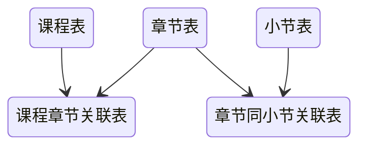
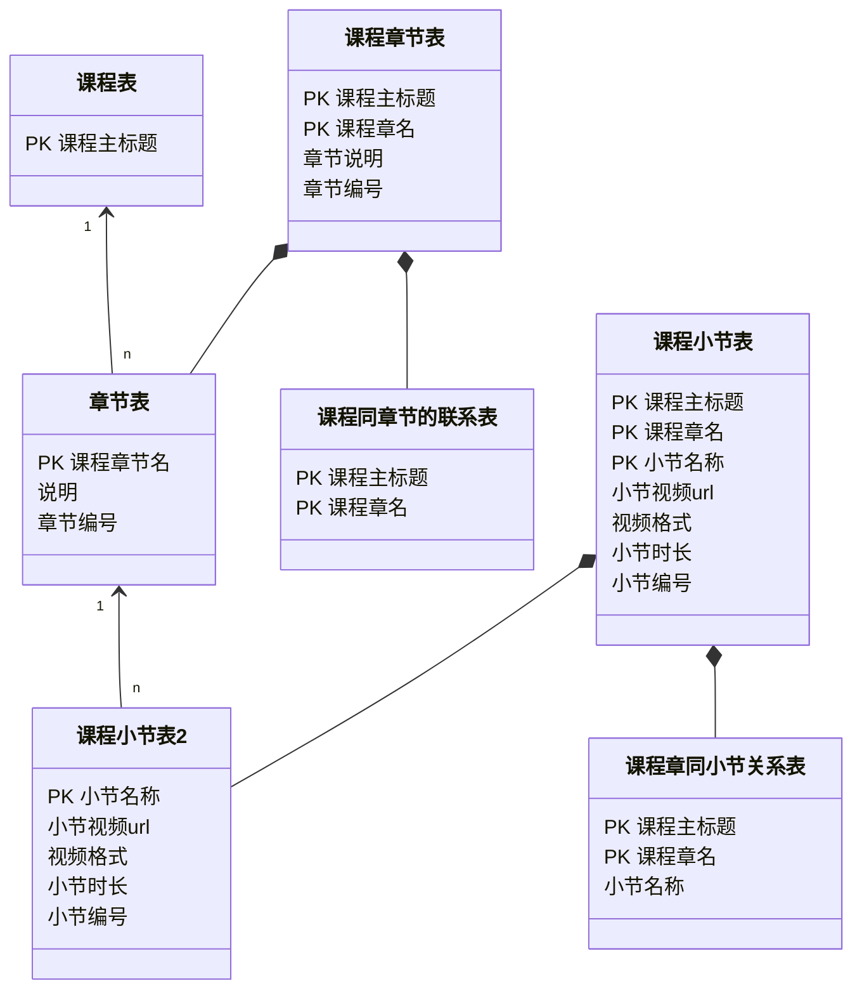
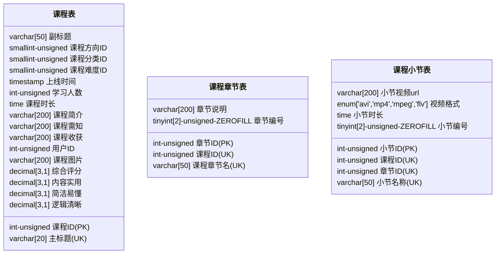
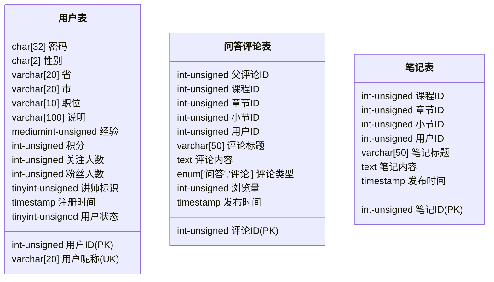
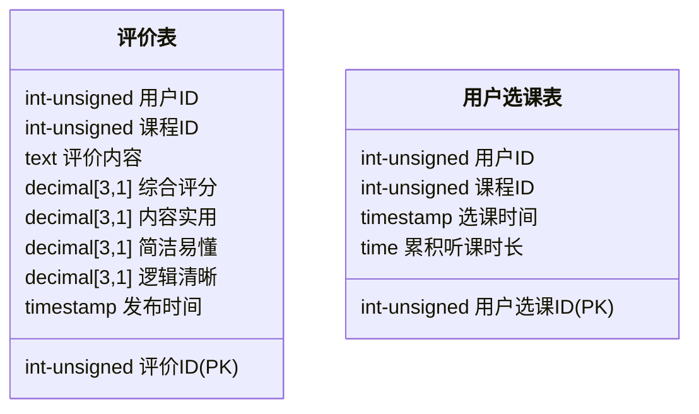

# 基础入门 全角度解读企业主流数据库 MySQL8.0

## 第 1 章 开篇引导

开篇将告诉同学们这几件事：

1.  为什么设计本课程？课程将帮助你 Get√ 到什么。
2.  课程适合人群？针对特定的人将收获什么。
3.  课程提供什么样的服务？如：查漏补缺问题库、答疑服务、QQ 群人脉资源...
4.  课程内容有哪些？通过思维导图，直观清晰呈现课程所涵盖丰富内容。
5.  课程学习的路线/个人成长路线是怎样的？

### 1-1 MySQL 必知必会：

1. **数据库选型**
   1. 选型之初：NoSQL VS SQL
   2. 选型确认：各种数据存储系统的适应场景
   3. 选型之终：构建 MySQL 开发环境
2. **数据库建模**
   1. 业务分析（人和）：一切故事的开始
   2. 逻辑设计（天时）：范式化 VS 反范式化
   3. 物理设计（地利）：根据 MySQL 特点进行设计
3. **数据库访问**
   1. 初级武器：MySQL 客户端
   2. 神兵利器：常用 GUI 工具
   3. 高阶神器：MySQL 驱动
   4. 必杀秘籍：访问故障处理
4. **SQL 开发**
   1. 基本功：DCL&DDL&DML
   2. 必备技：常用函数
   3. 高阶功法：CTE 及窗口函数
5. **SQL 优化**
   1. 优化前题：分析执行计划
   2. 优化进阶：索引和 SQL 改写
   3. 专家技能：排查性能瓶颈
6. **事务和高并发**
   1. 问道：什么是事务
   2. 发现：高并发的隐患
   3. 知否：事务隔离级别
   4. 顿悟：阻塞和死锁

### 1-2 课程环境

1. CentOS 7
2. MySQL 8.0
3. SQLyog

### 1-3 课程学习顺序

1. 给程序猿的 MySQL 必知必会（本课程）
2. MySQL 全面提升，打造扛的住的 MySQL 架构（架构）
3. MySQL+MyCAT 搭建高可用企业级集群（架构）
4. MySQL 电商项目（综合）
5. MySQL 面试指南（综合）

## 第 2 章 数据库选型

技术选型，带大家从一开始就高起点，赢在起跑线上。本章主要内容就是来比较一下常见的两种数据存储系统关系型数据库和非关系型数据库的主要特点，以及他们各自适用的场景，让我们在做出选择时不再迷茫。

### 2-1 SQL VS NOSQL

- SQL
  - MySQL
  - Oracle
  - SQLServer
  - PostGreSQL
- NoSQL
  - HBase
  - MongoDB
  - Redis
  - Hadoop

### 2-2 关系型数据库的特点和适用场景

关系数据库的特点：

- 数据结构化存储在二维表中。
- 支持事务的原子性 A，一致性 C，隔离性 I，持久性 D 特性。
- 支持使用 SQL 语言对存储在其中的数据进行操作。

关系数据库的适用场景：

- 数据之间存在着一定关系，需要关联查询数据的场景。
- 需要事务支持的业务场景。
- 需要使用 SQL 语言灵活操作数据的场景。

### 2-3 非关系型数据库的特点和适用场景

非关系型数据库特点：

- 存储结构灵活，没有固定结构。
- 对事务的支持比较弱，但对数据的并发处理性能高。
- 大多不使用 SQL 语言操作数据。

非关系数据库的适用场景：

- 数据结构不固定的场景。
- 对事务要求不高，但读写并发比较大的场景。
- 对数据的处理操作比较简单的场景。

### 2-4 关系统型数据库选型步骤

关系数据库选型原则：

- 数据库使用的广泛性
- 数据库的可扩展性
- 数据库的安全性和稳定性
- 数据库所支持的系统
- 数据库的使用成本

### 2-5 为项目选择适合的数据库

1. 数据库使用的广泛性 [查看排行榜](https://db-engines.com/en/ranking)
   1. Oracle
   2. MySQL
   3. Microsoft Server
   4. PostgreSQL
   5. MongoDB
   6. Redis
2. MySQL 数据库的可扩展性
   - 支持基于二进制日志的逻辑复制
   - 存在多种第三方数据库中间层，支持读写分离及分库分表。
3. MySQL 的安全性和稳定性
   - MySQL 主从复制集群可达到 99%的可用性。
   - 配合主从复制高可用架构可以达到 99.99%的可用性。
   - 支持对存储在 MySQL 的数据进行分级安全控制。

> ### 2-6 下载安装 VirtualBox

> ### 2-7 准备虚拟服务器

### 2-8 安装 WSL2 Ubuntu 系统

https://iknow.fun/2022/05/29/wsl2-javascript-python-vscode-huan-jing-pei-zhi-zong-jie/

> ### 2-9 配置 Ubuntu 系统

> CentOS Linux 已停止维护

### 2-10 安装 MySQL 8.0

安装 MySQL

https://docs.microsoft.com/zh-cn/windows/wsl/tutorials/wsl-database

在 WSL (ie 上安装 MySQL。Ubuntu) ：

1. 打开 WSL 终端 (即。Ubuntu) 。
2. 更新 Ubuntu 包：`sudo apt update`
3. 更新该包后，使用以下命令安装 MySQL：`sudo apt install mysql-server`
4. 确认安装并获取版本号：`mysql --version`

可能还想运行包含的安全脚本。 这会更改一些不太安全的默认选项，例如远程根登录名和示例用户。 运行安全脚本：

1. 启动 MySQL 服务器：`sudo /etc/init.d/mysql start`
2. 启动安全脚本提示符：`sudo mysql_secure_installation`
3. 第一个提示符会询问是否要设置验证密码插件，该插件可用于测试 MySQL 密码的强度。 然后将为 MySQL 根用户设置密码，决定是否删除匿名用户，决定是否允许根用户本地和远程登录，决定是否删除测试数据库，最后决定是否立即重新加载特权表。

若要打开 MySQL 提示符，请输入：`sudo mysql`

若要查看可用的数据库，请在 MySQL 提示符中输入：`SHOW DATABASES;`

若要创建新数据库，请输入：`CREATE DATABASE database_name;`

若要删除数据库，请输入：` DROP DATABASE database_name;`

有关使用 MySQL 数据库的更多信息，请参阅 [MySQL 文档](https://dev.mysql.com/doc/mysql-getting-started/en/)。

若要在 VS Code 中使用 MySQL 数据库，请尝试使用 [MySQL 扩展](https://marketplace.visualstudio.com/items?itemName=cweijan.vscode-mysql-client2)。

1、执行 `sudo apt install mysql-server` 安装 mysql-server。_本文 mysql-server 的版本是 8.0_

安装过程中会提示设置 root 密码，按照提示输入即可

2、验证安装 `mysql -u root -p`

3、修改 root 用户的远程访问权限 `update user set host='%' where user='root';`

4、刷新权限表`FLUSH PRIVILEGES;`

5、重启 mysql 服务

> ### 2-11 部署 MySQL8.0.15

### 2-12 配置 MySQL8.0

```
启动文件
vim /etc/init.d/mysql
配置文件
vim /etc/mysql/my.cnf
```

**常用命令**

```bash
sudo service mysql start
sudo service mysql stop
sudo service mysql restart
# 进入命令行
sudo mysql
# 用户名root 密码root 进入命令行
sudo mysql -uroot -proot
```

#### 修改root密码

查看用户名和 host：`select user,host from user;`

1. 在 /etc/mysql 下面有一个 debain.cnf 文件中记录了 mysql 的初始用户和密码，您可以用此用户登录去修改 root 密码

   - 本来没设置root密码可跳过这步，直接到第三步去设置新密码。

   > centos 的 /etc 下是没有这个文件的，debian.cnf 应该是 debian 和 ubuntu 系统下才有的。本来没设置root密码可跳过这步，直接到第三步修改为新密码。

    ```bash
    (study) eis:/etc/mysql $ sudo cat debian.cnf 
    # Automatically generated for Debian scripts. DO NOT TOUCH!
    [client]
    host     = localhost
    user     = debian-sys-maint
    password = s4fc2sdf
    socket   = /var/run/mysqld/mysqld.sock
    [mysql_upgrade]
    host     = localhost
    user     = debian-sys-maint
    password = dQgoXtTH83Q4AbDp
    socket   = /var/run/mysqld/mysqld.sock
    ```

2. 使用这个账户登录，修改root密码。

   ```mysql
   # 先把root的旧密码置空
   use mysql;
   
   update user set authentication_string='' where user='root';
   
   # 查看root用户的校验字符串是否被置空；
   select user, authentication_string from mysql.user; 
   
   # 刷新保存
   flush privileges;
   
   # 备注：Mysql5.7+ password字段 已改成 authentication_string字段
   ```

3. 重置成新密码

   ```mysql
   # 跳过第二步的需要先 use mysql;
   # 重置成新密码
   alter user 'root'@'%' identified by 'newpassword';
   
   # 或者：alter user 'root'@'localhost' identified by 'newpassword';
   
   备注：Mysql8.0修改密码方式已有变化（此处是个坑，需要注意）
   Mysql8.0之前：
   update user set password=password('root') where user='root';
   ```


#### [windows 连接 WSL-ubuntu 里安装的 MySQL](https://blog.csdn.net/sexyluna/article/details/105007828)

接着重启 mysql 服务，当以为大功告成时，mysql 再次给了我一个晴天霹雳，shell 上冒出以下错误

- mysql 启动失败：su: warning: cannot change directory to /nonexistent: No such file or directory

这种错误一般是 mysql 服务器异常关机导致的

解决方案如下：

```bash
# Ubuntu
sudo service mysql stop
sudo usermod -d /var/lib/mysql/ mysql
sudo service mysql start
```

作者：JyLie
链接：https://juejin.cn/post/6961800061210591268

#### [MySQL 在 WSL2 上的安装及配置 文章目录](https://blog.csdn.net/qq_41918762/article/details/112402106)

```mysql
// 新建用户 newuser 密码为：password
CREATE USER 'newuser'@'localhost' IDENTIFIED BY 'password';

// 这条语句是将 mysql 的database授权给 newuser
// 这是因为 newuser 没有权限来 create database
GRANT ALL ON mysql.* TO 'newuser'@'localhost';
grant all privileges on mysql.* to 'newuser'@'%';

use mysql;
update mysql.user set host = '%' where user = 'newuser';
flush privileges;
```

注释掉 bind-address

Edit your MySql config by typing this in your Ubuntu instance: `sudo nano /etc/mysql/mysql.conf.d/mysqld.cnf`

Change the line: `bind-address = 127.0.0.1`

To: `bind-address = 0.0.0.0`

or change `0.0.0.0` to the IP returned by `wsl hostname -I`.

Restart MySql using: `sudo service mysql restart`

那是因为 MySQL 默认只能通过本机访问。所以，需要修改为允许远程访问：

```mysql
use mysql;
update mysql.user set host = '%' where user = 'root';
flush privileges;
```

**删除用户**

```mysql
mysql>Delete FROM user Where User='test' and Host='localhost';

 mysql>flush privileges;

# 删除用户的数据库
 mysql>drop database testDB;

# 删除账户及权限：
drop user 用户名@'%';
drop user 用户名@localhost; 
```


> ### 2-13 初始化 MySQL8.0.15

> ### 2-14 本章总结

## 第 3 章 关于数据库设计

本章节“三部曲”，程序猿的必备技：

1. 前奏：【业务分析】欲善其事，必三思而行；
2. 高潮：【逻辑设计】范式化 VS 反范式化；
3. 结束：【物理设计】存储引擎&数据类型&命名规约。

### 3-2 实战项目需求分析

1. 业务分析
2. 逻辑设计
3. 数据类型
4. 对像命名
5. 建立库表

#### 实战项目需求总结

- 慕课网免费课前端项目
  - 课程的属性：{主标题，副标题，方向，分类，难度，最新，最热，时长，简介，人数需知，收获，讲师名，讲师职位，课程图片，综合评分，内容实用，简洁易懂，逻辑清晰}
  - 课程列表的属性：{章名，小节名，说明，小节时长章节url，视频格式}。
  - 讲师的属性：{讲师呢称说明，性别，省，市，职位，说明，经验，积分，关注人数粉丝人数}
  - 问答评论属性：{类型，标题，内容，关联章节，浏览量，发布时间，用户昵称）
  - 笔记的属性：{用户昵称，关联章节，笔记标题，笔记内容，发布时间}。
  - 用户的属性：{用户昵称，密码，说明，性别，省，市，职位，说明，经验，积分，关注人数粉丝人数}
  - 评价的属性：{用户，课程主标题，内容，综合评分，内容实用，简洁易懂，逻辑清晰，发布时间}

### 3-4 宽表模式

把对象所有的数据存储到表中

- 数据冗余：相同数据多次出现

#### 宽表模式的数据更新异常

- 数据更新异常：修改一行中某列的值时，同时修改了多行数据

#### 宽表模式的数据插入异常

- 数据插入异常：部分数据由于缺失主键信息而无法写入表中

#### 宽表模式的适用场景

- 宽表模式存在的问题
  - 数据插入异常：部分数据由于缺失主键信息而无法写入表中
  - 数据更新异常：修改一行中某列的值时，同时修改了多行数据
  - 数据删除异常：删除某一数据时不得不删除另一数据
  - 数据冗余：相同的数据在一个表中出现了多次

### 3-8 范式

#### 数据库第一设计范式

- 第一范式：表中的所有字段都是不可再分的

#### 数据库第二设计范式

- 第二范式：表中必须存在业务主键，并且非主键依赖于全部业务主键

#### 数据库第三设计范式

- 第三范式：表中的非主键列之间不能相互依赖

### 3-11 根据设计范式逻辑建模

课程对象：

- 课程的属性：{主标题，副标题，方向，分类，难度，最新，最热，时长，简介，人数，需知，收获，讲师昵称，讲师职位，课程图片，综合评分，内容实用，简洁易懂，逻辑清晰}
- **课程表**：{<u>主标题</u>，副标题，方向，分类，难度，上线时间，学习人数，时长简介，需知，收获，讲师呢称，课程图片，综合评分，内容实用，简洁易懂，逻辑清晰}

#### 课程列表对象逻辑建模

课程对象增加：

- **课程方向表**：{<u>课程方向名称</u>，添加时间}
- **课程分类表**：{<u>分类名称</u>，添加时间}
- **课程难度表**：{<u>课程难度</u>，添加时间}

课程列表对象：

- 课程列表的属性：{章节名，小节名，说明，小节时长，章节url，视频格式} （不满足第二范式）
- 拆分:
  - **课程章节表**：{<u>课程章节名</u>，说明，章节编号}
  - **课程同章节的联系表**：{<u>课程主标题</u>，<u>课程章节名</u>}
  - **课程小节表**：{<u>小节名称</u>，小节视频url，视频格式，小节时长，小节编号}
  - **课程章同小节关系表**：{<u>课程主标题</u>，<u>课程章节名</u>，<u>小节名称</u>}

#### 用户对象逻辑建模

讲师对象：

- 讲师的属性：{讲师昵称，密码，性别，省，市，职位，说明，经验，积分，关注人数，粉丝人数}
- 讲师表：{<u>讲师昵称</u>，密码，性别，省，市，职位，说明，经验，积分，关注人数，粉丝人数}

用户对象：

- 用户的属性：{用户呢称，密码，性别，省，市，职位，说明，经验，积分，关注人数粉丝人数}
- 用户表：{<u>用户呢称</u>，密码，性别，省，市，职位，说明，经验，积分，关注人数粉丝人数}

合并用户和讲师表：

- **用户表**：{<u>用户昵称</u>，密码，性别，省，市，职位，说明，经验，积分，关注人数，粉丝人数，讲师标识}

#### 问答评论对象逻辑建模

问答评论对象：

- 问答评论属性：{类型，标题，内容，关联章节，浏览量，发布时间，用户呢称）
  - 关联章节：{课程主标题，课程章名，小节名称}
- **问答评论表**：{<u>标题，课程主标题，课程章名，小节名称，用户昵称</u>，父评论标题，内容，类型，浏览量，发布时间}

#### 课程评价对象逻辑建模

笔记对象：

- 笔记的属性：{用户昵称，关联章节，笔记标题，笔记内容，发布时间}
- **笔记表**：{<u>笔记标题，课程主标题，课程章名，小节名称，用户昵称</u>，笔记内容，发布时间}

评价对象：

- 评价的属性：{用户呢称，课程主标题，内容，综合评分，内容实用，简洁易懂，逻辑清晰，发布时间}
- **评价表**：{<u>用户昵称，课程主标题</u>，内容，综合评分，内容实用，简洁易懂，逻辑清晰，发布时间}
- **用户选课表**：{<u>用户昵称，课程主标题</u>，选课时间，累积听课时长}

#### 对项目进行逻辑建模-总结

1. **课程表**：{<u>主标题</u>，副标题，方向，分类，难度，上线时间，学习人数，时长简介，需知，收获，讲师呢称，课程图片，综合评分，内容实用，简洁易懂，逻辑清晰}
2. **课程方向表**：{<u>课程方向名称</u>，添加时间}
3. **课程分类表**：{<u>分类名称</u>，添加时间}
4. **课程难度表**：{<u>课程难度</u>，添加时间}
5. **课程章节表**：{<u>课程章节名</u>，说明，章节编号}
6. **课程同章节的联系表**：{<u>课程主标题</u>，<u>课程章节名</u>}
7. **课程小节表**：{<u>小节名称</u>，小节视频url，视频格式，小节时长，小节编号}
8. **课程章同小节关系表**：{<u>课程主标题</u>，<u>课程章节名</u>，<u>小节名称</u>}
9. **用户表**：{<u>用户昵称</u>，密码，性别，省，市，职位，说明，经验，积分，关注人数，粉丝人数，讲师标识}
10. **问答评论表**：{<u>标题，课程主标题，课程章名，小节名称，用户昵称</u>，父评论标题，内容，类型，浏览量，发布时间}
11. **笔记表**：{<u>笔记标题，课程主标题，课程章名，小节名称，用户昵称</u>，笔记内容，发布时间}
12. **评价表**：{<u>用户昵称，课程主标题</u>，内容，综合评分，内容实用，简洁易懂，逻辑清晰，发布时间}
13. **用户选课表**：{<u>用户昵称，课程主标题</u>，选课时间，累积听课时长}

### 3-17 范式化设计存在的问题

一条数据要查五张表，效率低



### 3-18 反范式化设计

合并关联表，减少表的数量

一条数据只需要查询三张表：课程表 课程章节表 课程小节表



> ### 3-19 反范式化设计总结

### 3-20 物理设计

#### 常用的 MySQL 存储引擎

| 引擎名称 | 事务 | 说明                                               | 是否推荐 |
| -------- | ---- | -------------------------------------------------- | -------- |
| MYSQM    | NO   | MySQL5.6 之前的默认引擎，最常用的非事务型存储引擎  | NO       |
| CSV      | NO   | 以 CSV 格式存储的非事务型存储引擎                  | NO       |
| Archive  | NO   | 只允许查询和新增数据而不允许修改的非事务型存储引擎 | NO       |
| Memory   | NO   | 是一种易失性（内存）非事务型存储引擎               | NO       |
| InnoDB   | YES  | 最常用的事务型存储引擎                             | YES      |

#### INNODB 存储引擎的特点

1. 事务型存储引擎支持 ACID

   > Atomicity（原子性）、Consistency（一致性）、Isolation（隔离性）、Durability（持久性）四种特性的缩写

2. 数据按主键聚集存储

   > 索引指向主键，主键越大索引越大，适合用自增 ID 作为主键

3. 支持行级锁及 MVCC

   > 行级锁：增加并发能力
   >
   > MVCC：多版本并发控制

4. 支持 Btree 和自适应 Hash 索引

   > 自适应 Hash 索引：InnoDB 在内存中自动建立的索引，自维护

5. 支持全文和空间索引

#### 跟据 Innodb 优化项目表结构

1. **课程表**：{<u>课程ID</u>，主标题，副标题，课程方向ID，课程分类ID，课程难度ID，上线时间，学习人数，课程时长，课程简介，学习需知，课程收获，用户ID，课程主图片，综合评分，内容评分，简洁易懂，逻辑清晰}
2. **课程章节表**：{<u>章节ID</u>，课程ID，课程章节名，说明，章节编号}
3. **课程小节表**：{<u>小节ID</u>，课程ID，章节ID，小节名称，小节视频url，视频格式，小节时长，小节编号}
4. **课程方向表**：{<u>课程方向ID</u>，课程方向名称，添加时间}
5. **课程分类表**：{<u>课程分类ID</u>，分类名称，添加时间}
6. **课程难度表**：{<u>课程难度ID</u>，课程难度，添加时间}
7. **用户表**：{<u>用户ID</u>，用户昵称，密码，性别，省，市，职位，说明，经验，积分，关注人数，粉丝人数，讲师标识，注册时间，用户状态}
8. **问答评论表**：{<u>评论ID</u>，父评论ID，课程ID，章节ID，小节ID，用户ID，评论标题，内容，类型，浏览量，发布时间}
9. **笔记表**：{<u>笔记ID</u>，课程ID，章节ID，小节ID，用户ID，笔记标题，笔记内容，发布时间}
10. **评价表**：{<u>评价ID</u>，用户ID，课程ID，内容，综合评分，内容实用，简洁易懂，逻辑清晰，发布时间}
11. **用户选课表**：{<u>用户选课ID，用户ID，课程ID</u>，选课时间，累积听课时长}

### 数据类型介绍

#### 数值类型

MySQL 支持所有标准 SQL 数值数据类型。

这些类型包括严格数值数据类型(INTEGER、SMALLINT、DECIMAL 和 NUMERIC)，以及近似数值数据类型(FLOAT、REAL 和 DOUBLE PRECISION)。

关键字 INT 是 INTEGER 的同义词，关键字 DEC 是 DECIMAL 的同义词。

BIT 数据类型保存位字段值，并且支持 MyISAM、MEMORY、InnoDB 和 BDB 表。

作为 SQL 标准的扩展，MySQL 也支持整数类型 TINYINT、MEDIUMINT 和 BIGINT。下面的表显示了需要的每个整数类型的存储和范围。

> 整数类型有 SIGNED 和 UNSINGED 属性，无符号正整数，数值范围翻一倍。

| 类型           | 大小                                          | 范围（有符号）                                                                                                                      | 范围（无符号）                                                    | 用途             |
| :------------- | :-------------------------------------------- | :---------------------------------------------------------------------------------------------------------------------------------- | :---------------------------------------------------------------- | :--------------- |
| TINYINT        | 1 Bytes                                       | (-128，127)                                                                                                                         | (0，255)                                                          | 小整数值         |
| SMALLINT       | 2 Bytes                                       | (-32 768，32 767)                                                                                                                   | (0，65 535)                                                       | 大整数值         |
| MEDIUMINT      | 3 Bytes                                       | (-8 388 608，8 388 607)                                                                                                             | (0，16 777 215)                                                   | 大整数值         |
| INT 或 INTEGER | 4 Bytes                                       | (-2 147 483 648，2 147 483 647)                                                                                                     | (0，4 294 967 295)                                                | 大整数值         |
| BIGINT         | 8 Bytes                                       | (-9,223,372,036,854,775,808，9 223 372 036 854 775 807)                                                                             | (0，18 446 744 073 709 551 615)                                   | 极大整数值       |
| FLOAT          | 4 Bytes                                       | (-3.402 823 466 E+38，-1.175 494 351 E-38)，0，(1.175 494 351 E-38，3.402 823 466 351 E+38)                                         | 0，(1.175 494 351 E-38，3.402 823 466 E+38)                       | 单精度 浮点数值  |
| DOUBLE         | 8 Bytes                                       | (-1.797 693 134 862 315 7 E+308，-2.225 073 858 507 201 4 E-308)，0，(2.225 073 858 507 201 4 E-308，1.797 693 134 862 315 7 E+308) | 0，(2.225 073 858 507 201 4 E-308，1.797 693 134 862 315 7 E+308) | 双精度 浮点数值  |
| DECIMAL        | 对 DECIMAL(M,D) ，如果 M>D，为 M+2 否则为 D+2 | 依赖于 M 和 D 的值                                                                                                                  | 依赖于 M 和 D 的值                                                | 小数值，保证精度 |

---

#### 实战实数类型

`double` 和 `float` 储存的是不精确的值

```mysql
create database test;
use test;
create table t(d1 double, d2 decimal(10,3));
insert into t values(11.2,11.2),(2.56,2.56),(9.01,9.01),(132.33,132.33);
select * from t;
select sum(d1),sum(d2) from t;
drop table t;
```

#### 日期和时间类型

表示时间值的日期和时间类型为 DATETIME、DATE、TIMESTAMP、TIME 和 YEAR。

每个时间类型有一个有效值范围和一个"零"值，当指定不合法的 MySQL 不能表示的值时使用"零"值。

TIMESTAMP 类型有专有的自动更新特性，将在后面描述。

| 类型      | 大小 ( bytes) | 范围                                                                                                                                    | 格式                       | 用途                     |
| :-------- | :------------ | :-------------------------------------------------------------------------------------------------------------------------------------- | :------------------------- | :----------------------- |
| DATE      | 3             | 1000-01-01/9999-12-31                                                                                                                   | YYYY-MM-DD                 | 日期值                   |
| TIME      | 3+[0-3]       | '-838:59:59'/'838:59:59'                                                                                                                | HH:MM:SS[.微秒]            | 时间值或持续时间         |
| YEAR      | 1             | 1901/2155                                                                                                                               | YYYY                       | 年份值                   |
| DATETIME  | 5+[0-3]       | 1000-01-01 00:00:00/9999-12-31 23:59:59                                                                                                 | YYYY-MM-DD HH:MM:SS[.微秒] | 混合日期和时间值         |
| TIMESTAMP | 4             | 1970-01-01 00:00:00/2038 结束时间是第 **2147483647** 秒，北京时间 **2038-1-19 11:14:07**，格林尼治时间 2038 年 1 月 19 日 凌晨 03:14:07 | YYYY-MM-DD -HH:MM:SS       | 混合日期和时间值，时间戳 |

---

#### 实战时间类型

Time 类型示例：

| 名称 | 使用方式 | 值              |
| :--- | :------- | :-------------- |
| dt0  | time     | 16.18.29        |
| dt2  | time(2)  | 16.18.29.72     |
| dt4  | time(4)  | 16.18.29.7182   |
| dt6  | time(6)  | 16.18.29.818216 |

Timestamp 类型示例：

```mysql
create table t_timestamp(dt timestamp);
insert into t_timestamp select now();
select * from t_timestamp;
set time_zone='+10:00';
drop table t_timestamp;
```

#### 字符串类型

字符串类型指 CHAR、VARCHAR、BINARY、VARBINARY、BLOB、TEXT、ENUM 和 SET。该节描述了这些类型如何工作以及如何在查询中使用这些类型。

| 类型       | 大小                  | 用途                            |
| :--------- | :-------------------- | :------------------------------ |
| CHAR(M)    | 0-255 字符            | 定长字符串                      |
| VARCHAR(M) | 0-65535 bytes         | 变长字符串                      |
| TINYBLOB   | 0-255 bytes           | 不超过 255 个字符的二进制字符串 |
| TINYTEXT   | 0-255 bytes           | 短文本字符串                    |
| BLOB       | 0-65 535 bytes        | 二进制形式的长文本数据          |
| TEXT       | 0-65 535 bytes        | 长文本数据                      |
| MEDIUMBLOB | 0-16 777 215 bytes    | 二进制形式的中等长度文本数据    |
| MEDIUMTEXT | 0-16 777 215 bytes    | 中等长度文本数据                |
| LONGBLOB   | 0-4 294 967 295 bytes | 二进制形式的极大文本数据        |
| LONGTEXT   | 0-4 294 967 295 bytes | 极大文本数据                    |
| ENUM       | 0-65535 bytes         | 只能使用列表中的值              |

**注意**：char(M) 和 varchar(M) 中括号中 M 代表字符的个数，并不代表字节个数，比如 CHAR(30) 就可以存储 30 个字符。

CHAR 和 VARCHAR 类型类似，但它们保存和检索的方式不同。它们的最大长度和是否尾部空格被保留等方面也不同。在存储或检索过程中不进行大小写转换。

BINARY 和 VARBINARY 类似于 CHAR 和 VARCHAR，不同的是它们包含二进制字符串而不要非二进制字符串。也就是说，它们包含字节字符串而不是字符字符串。这说明它们没有字符集，并且排序和比较基于列值字节的数值值。

BLOB 是一个二进制大对象，可以容纳可变数量的数据。有 4 种 BLOB 类型：TINYBLOB、BLOB、MEDIUMBLOB 和 LONGBLOB。它们区别在于可容纳存储范围不同。

有 4 种 TEXT 类型：TINYTEXT、TEXT、MEDIUMTEXT 和 LONGTEXT。对应的这 4 种 BLOB 类型，可存储的最大长度不同，可根据实际情况选择。

> #### 整数类型

> #### 实数类型

> #### 时间类型

> #### 字符串类型

### 3-30 确定表的数据类型

#### 如何为数据选择合适的数据类型

- 优先选择符合存储数据需求的最小数据类型。
  - Bigint or Unsigned int: 3147483647
  - IP 地址存储：
    - `INET ATON('255.255.255.255')=4294967295`
    - `INET_NTOA(4294967295)='255.255.255.255'`
    - 使用 Unsigned int
- 谨慎使用 ENUM，TEXT 字符串类型。
  - TEXT：
    - 缺点：无法使用内存映射表，只能使用磁盘映射表，需要二次查找，无法索引太长的字段，不能有默认值。
    - 优化：分离到单独的表中，只取必要的列。
  - ENUM：
    - 优点：以整数存储，节约空间。
    - 缺点：枚举类型难以修改，有修改风险。
- 同财务相关的数值型数据，必需使用 decimal 类型。

#### 课程、章节、小节表的数据类型

Typora 不显示实体属性和不支持中文，用类图表示。

类图类型用方括号替换圆括号，用`-`替换类型中间的空格。

属性名后的圆括号内容表示主键、外键，用于区分普通属性（原本用于表示类的方法）。



#### 课程方向、分类、难度表


#### 用户表、问答评论表、笔记表的数据类型

md5 加密后产生定长 32 位密码



#### 评价表、用户选课表



### 3-36 数据库对象命名原则

#### 如何为表和列选择适合的名字

1. 所有数据库对像名称必须使用小写字母可选用下划线分割。
2. 所有数据库对像名称定义禁止使用 [MySQL 保留关建字](https://dev.mysql.com/doc/refman/8.0/en/keywords.html)。
3. 数据库对像的命名要能做到见名识义，并且最好不要超过 32 个字。
4. 临时库表必须以 tmp 为前缀并以日期为后缀。
5. 用于备份的库，表必须以 bak 为前缀并以日期为后缀。
6. 所有存储相同数据的列名和列类型必须一致。

#### 为项目数据库对像命名

| 课程表      | imc_course    |                   |
| ----------- | ------------- | ----------------- |
| 列名        | 代码          | 数据类型          |
| 课程ID(PK) | course_id     | int unsigned      |
| 主标题(UK)  | title         | varchar(20)       |
| 副标题      | title_desc    | varchar(50)       |
| 课程方向ID | type_id       | smallint unsigned |
| 课程分类ID | class_id      | smallint unsigned |
| 课程难度ID | level_id      | smallint unsigned |
| 上线时间    | online_time   | timestamp         |
| 学习人数    | study_cnt     | int unsigned      |
| 课程时长    | course_time   | time              |
| 课程简介    | intro         | varchar(200)      |
| 课程需知    | info          | varchar(200)      |
| 课程收获    | harest        | varchar(200)      |
| 用户ID     | user_id       | int unsigned      |
| 课程图片    | main_pic      | varchar(200)      |
| 综合评分    | content_score | decimal(3,1)      |
| 内容实用    | level_score   | decimal(3,1)      |
| 简洁易懂    | logic_score   | decimal(3,1)      |
| 逻辑清晰    | score         | decimal(3,1)      |

| 课程章节       | imc_chapter  |                              |
| -------------- | ------------ | ---------------------------- |
| 列名           | 代码         | 数据类型                     |
| 章节ID(PK)    | shapter_id   | int unsigned                 |
| 课程ID(UK)    | course_id    | int unsigned                 |
| 课程章节名(UK) | chapter_name | varchar(50)                  |
| 章节说明       | chapter_info | varchar(200)                 |
| 章节编号       | chapter_no   | tinyint(2) unsigned ZEROFILL |

| 课程小节     | imc_subsection |                                |
| ------------ | -------------- | ------------------------------ |
| 列名         | 代码           | 数据类型                       |
| 小节ID(PK)  | sub_id         | int unsigned                   |
| 课程ID(UK)  | chapter_id     | int unsigned                   |
| 章节ID(UK)  | course_id      | int unsigned                   |
| 小节名称(UK) | sub_name       | varchar(50)                    |
| 小节视频url | sub_url        | varchar(200)                   |
| 视频格式     | video_type     | enum('avi','mp4','mpeg','flv') |
| 小节时长     | sub_time       | time                           |
| 小节编号     | sub_no         | tinyint(2) unsigned ZEROFILL   |

| 课程分类         | imc_class  |              |
| ---------------- | ---------- | ------------ |
| 列名             | 代码       | 数据类型     |
| 课程方向ID(PK)  | class_id   | int unsigned |
| 课程方向名称(UK) | class_name | varchar(10)  |
| 添加时间         | add_time   | timestamp    |

| 课程难度        | imc_level  |              |
| --------------- | ---------- | ------------ |
| 列名            | 代码       | 数据类型     |
| 课程难度ID(PK) | level_id   | int unsigned |
| 课程难度(UK)    | level_name | varchar(10)  |
| 添加时间        | add_time   | timestamp    |

| 课程方向        | imc_type  |              |
| --------------- | --------- | ------------ |
| 列名            | 代码      | 数据类型     |
| 课程分类ID(PK) | type_id   | int unsigned |
| 分类名称(UK)    | type_name | varchar(10)  |
| 添加时间        | add_time  | timestamp    |

| 用户         | imc_user    |                    |
| ------------ | ----------- | ------------------ |
| 列名         | 代码        | 数据类型           |
| 用户ID(PK)  | user_id     | int unsigned       |
| 用户昵称(UK) | user_nick   | varchar(20)        |
| 密码         | user_pwd    | char(32)           |
| 性别         | sex         | char(2)            |
| 省           | province    | varchar(20)        |
| 市           | city        | varchar(20)        |
| 职位         | position    | varchar(10)        |
| 说明         | mem         | varchar(100)       |
| 经验         | exp_cnt     | mediumint unsigned |
| 积分         | score       | int unsigned       |
| 关注人数     | follow_cnt  | int unsigned       |
| 粉丝人数     | fans_cnt    | int unsigned       |
| 讲师标识     | is_teacher  | tinyint unsigned   |
| 注册时间     | reg_time    | timestamp          |
| 用户状态     | user_status | tinyint unsigned   |

| 问答评论表  | imc_question  |                     |
| ----------- | ------------- | ------------------- |
| 列名        | 代码          | 数据类型            |
| 评论ID(PK) | quest_id      | int unsigned        |
| 父评论ID   | user_id       | int unsigned        |
| 课程ID     | course_id     | int unsigned        |
| 章节ID     | chapter_id    | int unsigned        |
| 小节ID     | sub_id        | int unsigned        |
| 用户ID     | replyid       | int unsigned        |
| 评论标题    | quest_title   | varchar(50)         |
| 评论内容    | quest_content | text                |
| 评论类型    | quest_type    | enum('问答','评论') |
| 浏览量      | view_cnt      | int unsigned        |
| 添加时间    | add_time      | timestamp           |

| 笔记表      | imc_note     |              |
| ----------- | ------------ | ------------ |
| 列名        | 代码         | 数据类型     |
| 笔记ID(PK) | note_id      | int unsigned |
| 课程ID     | user_id      | int unsigned |
| 章节ID     | course_id    | int unsigned |
| 小节ID     | chapter_id   | int unsigned |
| 用户ID     | sub_id       | int unsigned |
| 笔记标题    | note_title   | varchar(50)  |
| 笔记内容    | note_content | text         |
| 添加时间    | add_time     | timestamp    |

| 评价表      | imc_classvalue |              |
| ----------- | -------------- | ------------ |
| 列名        | 代码           | 数据类型     |
| 评价ID(PK) | value_id       | int unsigned |
| 用户ID     | user_id        | int unsigned |
| 课程ID     | course_id      | int unsigned |
| 评价内容    | content        | text         |
| 内容实用    | content_score  | decimal(3,1) |
| 综合评分    | level_score    | decimal(3,1) |
| 逻辑清晰    | logic_score    | decimal(3,1) |
| 综合评分    | score          | decimal(3,1) |
| 添加时间    | add_time       | timestamp    |

| 用户选课表      | imc_selectcourse |              |
| --------------- | ---------------- | ------------ |
| 列名            | 代码             | 数据类型     |
| 用户选课ID(PK) | select_id        | int unsigned |
| 用户ID         | user_id          | int unsigned |
| 课程ID         | course_id        | int unsigned |
| 选课时间        | select_time      | timestamp    |
| 累积听课时长    | study_time       | time         |

本章总结

## 第 4 章 【众生视角】访问数据库的 N 种武器和姿势【必要常识】

本章节不仅适用于各语言开发工程师，也适用于：

1. 关注数据的产品、运营；
2. 测试工程师；
3. 运维工程师。

提供四类武器，各取所需：

1. 【初级武器】MySQL 客户端；
2. 【神兵利器】常用 GUI 工具；
3. 【高阶神器】MySQL 驱动；
4. 【必杀秘器】故障排查。

### 4-1 使用命令行工具访问 MySQL

```bash
mysql -uroot -p -hlocalhhost
# mysql -u<用户名> -p<密码> -h<网络ip地址>
# -e<SQL(直接执行不进入命令行模式)> 
```

> ### 4-2 使用 SQLyog 访问 MySQL

自选图形化界面软件

### 4-3 解锁 Python 的 MySQL 驱动类库

[Python 环境安装教程](https://iknow.fun/2022/05/29/wsl2-javascript-python-vscode-huan-jing-pei-zhi-zong-jie/)

> ### 4-4 实战部署 Python 的 MySQL 驱动类库

### 4-5 开发 Python 操作 MySQL 数据库

```python
import pymysql

db_host = 'localhost'
db_user = 'root'
db_pass = 'root'
db_database = 'mysql'
db_port = 3306

if __name__ == '__main__':
    conn = pymysql.connect(host=db_host, port=db_port,
                           user=db_user, passwd=db_pass, db=db_database)
    sqlstr="""
      select user,host from user
    """
    cursor = conn.cursor()
    cursor.execute(sqlstr)
    result = cursor.fetchall()
    for i in result:
      print("user:%s host:%s"%(i[0],i[1]))
    conn.close()

```


### 4-6 排查 MySQL1045 错误解决访问异常

`pymysql.err.OperationalError:（1045，u"Access denied for user root'@'192.168.1.10'（using password:YES）"）`

- 确认密码是否正确。
- 确认是否有对IP的授权，%不包括localhost。
- 网络是否畅通。

`pymysql.err.InternalError:（1153，u"Got a packet bigger than max_allowed_packet'bytes"）`

- 增加`max_allowed_packet`配置的大小。

- `SET PERSIST max_allowed_packet=100*1024*1024`


> ### 4-7 排查 MySQL1153 错误解决访问异常
>
> ### 4-8 本章总结
>

## 第 5 章 【极客视角】玩转 SQL 开发“道”与“术”之道篇【适用于日常工作】

本章品味独特，剑指 Geek Style。

围绕核心是“工作”，针对日常工作常用的知识。

包含工作基本功+工作必备技，两大部分：

1. 【工作基本功】DCL& DDL& DML；
2. 【工作必备技 】常用函数。

### 5-1 【开始起航】初识 SQL

### 5-2 【解锁】数据库访问控制语句

### 5-3 【详解】数据库账号创建命令

### 5-4 【实战】 创建项目数据库账号

### 5-5 【解锁】 数据库用户授权语句

### 5-6 【详解】数据库用户授权命令

### 5-7 【实战】数据库用户授权语句

### 5-8 【工作填坑技能】为数据库用户授权时易犯错误

### 5-9 【实操】使用 Revoke 回收数据库用户权限

### 5-10 【实战必会】 常用的 DDL 语句-1

### 5-11 【实战必会】 常用的 DDL 语句-2

### 5-12 【实战】 创建项目数据库 imc_db

### 5-13 【解锁】使用 create table 建立表

### 5-14 【解锁】使用 alter table 修改表

### 5-15 【解锁】使用 drop table 删除表

### 5-16 【解析】建立项目课程表

### 5-17 【解析】建立项目课程相关表

### 5-18 【解析】建立问答相关表

### 5-19 【实战】 建立项目中的表

### 5-20 【必知】索引维护语句

### 5-21 【必会】其它 DDL 语句的用法

## 第 6 章 【极客视角】玩转 SQL 开发“道”与“术”之术篇【工作高阶技能】

本章带你玩转 SQL 开发，学习其实可以很快乐哦。围绕核心是“工作”较为高阶技能和加薪技能，主要是如下两部分：

1. 【工作高阶技】With 语句；
2. 【工作加薪技】窗口函数。

### 6-1 【初识】DML 语句

### 6-2 【提升思维】编写 Insert 语句的思路

### 6-3 【开发常用】实战 insert 语句

### 6-4 【开发必备】使用 select 语句查询表中的数据

### 6-5 使用 Where 子句过滤表中的行

### 6-6 使用比较运算符过滤数据

### 6-7 【实战】MySQL 中的比较运算符-1

### 6-8 【实战】MySQL 中的比较运算符-2

### 6-9 【面试常问】使用逻辑运算符关联多个过滤条件

### 6-10 【实战】MySQL 逻辑运算符-1

### 6-11 【实战】 MySQL 逻辑运算符-2

### 6-12 【解锁】从多个表中查询数据

### 6-13 【实战】使用内关联查询多个表中的数据

### 6-14 【解锁】外联接查询

### 6-15 【实战】 外关联查询

### 6-16 使用 Group by 分组查询结果

### 6-17 【实战】分组统计查询

### 6-18 使用 having 子句过滤分组结果

### 6-19 MySQL 中的分组函数-1

### 6-20 MySQL 中的分组函数-2

### 6-21 MySQL 中的分组函数-3

### 6-22 使用 order by 子句排序查询结果

### 6-23 使用 Limit 子句限制返回的行数

### 6-24 【解锁】使用 Create View 语句创建视图

### 6-25 【初识】数据删除语句 Delete

### 6-26 【实战】使用 Delete 语句删除数据

### 6-27 【初识】 数据更新语句 Update

### 6-28 【实战】使用 Update 语句修改数据

### 6-29 使用 SQL 获取数据库时间

### 6-30 使用 SQL 转换时间数据

### 6-31 使用 SQL 进行时间计算

### 6-32 使用 SQL 提取部分时间值

### 6-33 使用 SQL 拼接字符串

### 6-34 使用 SQL 判断字符串的长度

### 6-35 使用 SQL 截取字符串

### 6-36 使用 SQL 按分隔符处理数据

### 6-37 MySQL 中的其它常用函数

### 6-38 【解锁】MySQL8.0 新增的公共表表达式

### 6-39 【实战】 公共表表达式-1

### 6-40 【实战】 公共表表达式-2

### 6-41 【解锁】MySQL8.0 新增的窗口函数

### 6-42 【实战】 窗口函数-1

### 6-43 【实战】 窗口函数-2

### 6-44 【实战】 窗口函数-3

### 6-45 【警惕】SQL 开发中易犯的错误-1

### 6-46 【警惕】 SQL 开发中易犯的错误-2

### 6-47 章节总结

## 第 7 章 【专家视角】揭开 SQL 优化神秘面纱【适用于升职加薪】

武以快为尊。同理，快速高效工作，同样的工作时长，却创造更多企业价值，凸显个人价值，才能立于不败之地。

本章将从专家的视角，为你揭开 SQL 优化神秘面纱，解锁 SQL 优化的升职加薪技能。让你在工作中比别人技高一筹，助你在工作中对 SQL 优化，慢查询优化能有独到的企业级解决方案，为你的高薪保驾护航。

### 7-1 【解锁】SQL 优化的步骤

### 7-2 发现有性能问题的 SQL

### 7-3 配置慢查询日志

### 7-4 慢查询日志分析利器

### 7-5 【实战】安装 percona 工具集

### 7-6 【实战】启用慢查询日志

### 7-7 【实战】分析慢查询日志

### 7-8 实时获取需要优化的 SQL

### 7-9 【解锁】什么是 SQL 的执行计划？

### 7-10 获取 SQL 的执行计划

### 7-11 【实战】 分析 SQL 的执行计划-[id 列]

### 7-12 【实战】 分析 SQL 的执行计划-[select_type 列]

### 7-13 【实战】 分析 SQL 的执行计划-[select-type 列]续

### 7-14 【实战】 分析 SQL 的执行计划-[table 列]

### 7-15 【实战】 分析 SQL 的执行计划-[type 列]

### 7-16 【实战】 分析 SQL 的执行计划-[type 列]续

### 7-17 【实战】 分析 SQL 的执行计划-[keys 相关列]

### 7-18 【实战】 分析 SQL 的执行计划-[rows 列]

### 7-19 【实战】 分析 SQL 的执行计划-[extra 列]

## 第 8 章 【专家视角】SQL 的索引优化之向面试开炮&吊打面试官

本章针对面试中高频考点：索引优化进行讲解，让你面试无忧，直接向面试开炮，甚至吊打面试官。

### 8-1 【解锁】SQL 优化的常用手段

### 8-2 【重要】在 MySQL 中索引的作用

### 8-3 Btree+索引的特点

### 8-4 如何选择在什么列上建立索引

### 8-5 【实战】 针对 SQL 语句的索引优化

### 8-6 【实战】如何选择索引键的顺序

### 8-7 【警惕】锁引使用的误区

### 8-8 SQL 优化的第二选择 SQL 改写

### 8-9 【实战】SQL 改写优化

### 8-10 本章小结

## 第 9 章 【架构师视角】搞定数据库并发高压，服务器永不宕机【可用于彰显你的眼界&格局】

本章紧扣数据库宕机这一企业痛点问题，讲解“高并发”下数据库企业级解决方案。

主要包含四个模块：

1. 【关于问道】事务是什么；
2. 【善于发现】高并发中的隐患；
3. 【不得不知】事务隔离级别；
4. 【解决之道】阻塞与死锁。

### 9-1 -1 什么是事务

### 9-2 -2 事务的 ACID 特性

### 9-3 并发带来的问题【脏读】

### 9-4 并发带来的问题【不可重复读和幻读】

### 9-5 【解锁】INNODB 的几种事务隔离级别

### 9-6 如何设置 INNODB 事务隔离级别

### 9-7 【实战】serializable 事务隔离级别

### 9-8 【实战】repeatable read 事务隔离级别

### 9-9 【实战】read committed 事务隔离级别

### 9-10 【实战】read uncommitted 事务隔离级别

### 9-11 【实战】事务阻塞的产生

### 9-12 产生阻塞的主要原因-【锁】

### 9-13 【重要】如何检测阻塞

### 9-14 【实战】 事务阻塞的捕获

### 9-15 如何处理事务中的阻塞

### 9-16 并发事务的另一个问题-【死锁】

### 9-17 【重要】 如何检测死锁

### 9-18 如何处理事务的死锁

### 9-19 事和和并发章节总结

## 第 10 章 【青春不散场】课程总结，彰显重点【知识梳理，重塑知识栈】

本章进行课程所有内容的梳理，总结回顾。提炼精华，再现经典。帮助同学们快速梳理，巩固升华，达到融会贯通，学以致用到工作所需中。

### 10-1 课程回顾及展望

### 10-2 课程回顾及展望-续
